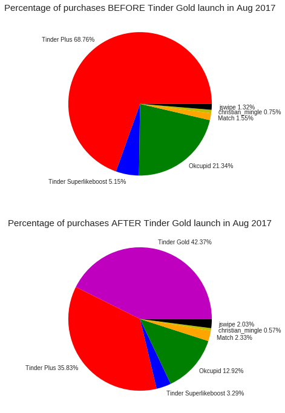
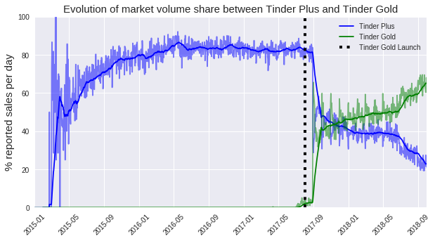
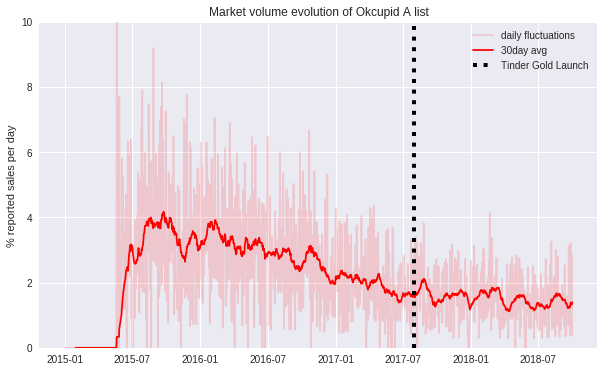
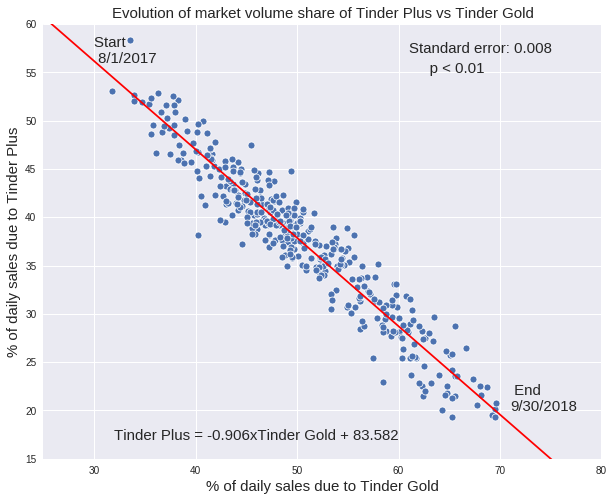
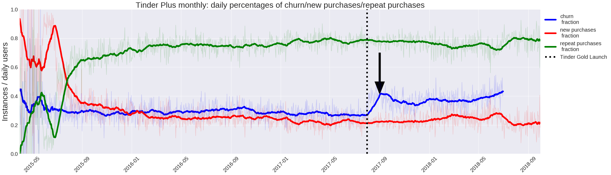
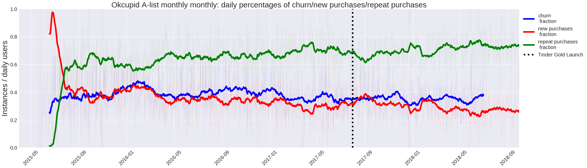
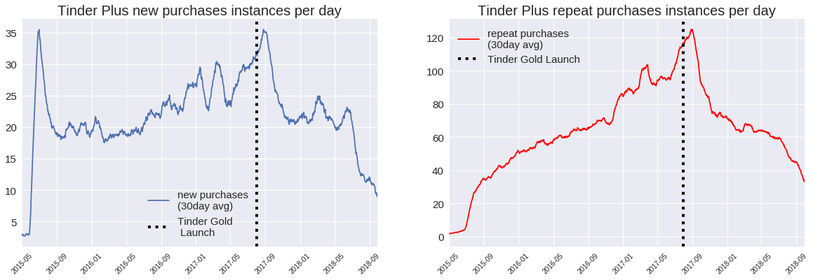
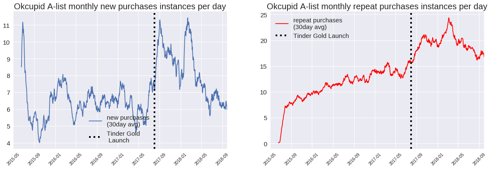
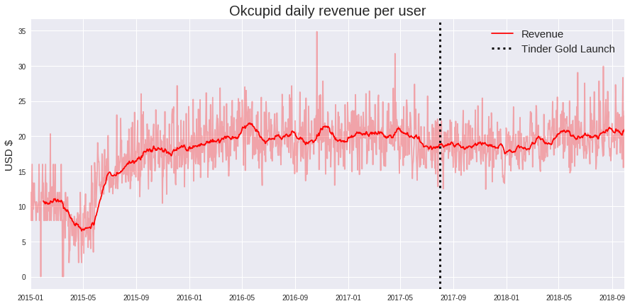
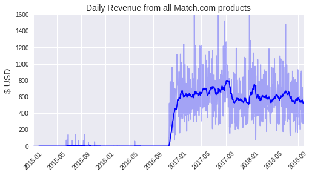

**The internet's love for Tinder Gold: Scientific analysis**

March 2019

By [Joe Ganser](mailto:JKGProfessional@gmail.com)

**ABSTRACT**

The purpose of this document is to explain step by step every code, action, and decision made in all the presented analysis. Sections are organized using click through links. *This notebook is written for scientists, and a seperate document oriented for business people is written [here](presentation.ipynb). Also, some dataframes are saved and packages reloaded so this notebook can be examined pieced by piece instead of having to go through the entire work flow start to finish in one sitting.* 

**TABLE OF CONTENTS**
   1. [Acquiring the data from Edison](#1)
   2. [Stategy of data analysis](#2)
       * [2.B Methods for engineering key features](#2.B)
   3. [Selecting the right features from the Edison data](#three)
   4. [Understanding the dating sphere](#4)
   5. [Data Cleaning](#5)
       * [5.A Getting rid of Netflix,Spotify and Linkedin rows](#5.A)
       * [5.B Value counts of product descriptions](#5.B)
       * [5.C Identifying/Formatting Tinder rows & products](#5.C)
       * [5.D Identifying/Formatting Okcupid rows & products](#5.D)
       * [5.E Identifying/Formatting Match rows & products](#5.E)
       * [5.F Identifying/Formatting Elitesingles rows & products](#5.F)
       * [5.G Identifying/Formatting Blackpeoplemeet rows & products](#5.G)
       * [5.H Identifying/Formatting Chemistry rows & products](#5.H)
       * [5.I Identifying/Formatting Howaboutwe rows & products](#5.I)
       * [5.J Identifying/Formatting Christian Mingle rows & products](#5.J)
       * [5.K Identifying/Formatting JDate rows & products](#5.K)
       * [5.L Identifying/Formatting JSwipe rows & products](#5.L)
       * [5.M Identifying/Formatting Plentyoffish rows & products](#5.M)
       * [5.N Identifying/Formatting Twoo rows & products](#5.N)
       * [5.O Identifying/Formatting Delightful rows & products](#5.O)
       * [5.P Pivoting & aggregating products](#5.P)
   6. [Formatting and engineering the features](#6)
       * [6.A Identifying instances of returning customers](#6.A)
       * [6.B Identifying instances of new customers](#6.B)
       * [6.C Identifying instances of churning customers](#6.C)
       * [6.D Formatting data into market sales volume/percentage structure](#6.D)
       * [6.E Formatting data into market revenue per day structure](#6.E)
   7. [Exploratory data analysis](#seven7)
       * [7.A Tabulating Each products's consumption breakdown](#7.A)
       * [7.B Fundamentals of the data itsself](#7.B)
       * [7.C Pie charting the distribution of products before and after Tinder Gold launch](#7.C)
   8. [Research Results](#eight)
       * [8.A Plotting market volume percentages across time & cointegration](#8.A)
       * [8.B Evolution of customer creation, repeat purchases and churn instances](#8.B)
       * [8.C Evolution of the revenue per number of daily customers for Tinder](#8.C)
   9. [Anomalies in the Data](#nine)
       * [9.A JSwipe Vs JDate](#9.A)
       * [9.B Inconsitencies collection of some products](#9.B)
       * [9.C Tinder Gold sold before launch date](#9.C)
       * [9.D Tinder U being absent from the data](#9.D)
   10. [Sources](#ten)

<a id='1'></a>
**1. Acquiring Edison Data**


```python
import pandas as pd
from battlefin import BattleFin
import warnings
warnings.filterwarnings('ignore')
bf = BattleFin()
#Get the data from both apple and google;
apple = bf.get('edison_competition',search_column='merchant_name', search_value='Apple')
google = bf.get('edison_competition',search_column='merchant_name', search_value='Google')
#concatenate them
data = pd.concat([apple,google],axis=0)
#drop any duplicates
data.drop_duplicates(inplace=True)
#save for later use
data.to_csv('edison_raw.csv')
print(data.shape)
data.head()
```

    Validating query...
    Estimated rows returned by this query: 1970332
    Pulling data...
    Data pull took: 55.648926734924316 seconds.
    DataFrame ready!
    Validating query...
    Estimated rows returned by this query: 108378
    Pulling data...
    Data pull took: 2.9204914569854736 seconds.
    DataFrame ready!
    (1523377, 27)


<div>
<style scoped>
    .dataframe tbody tr th:only-of-type {
        vertical-align: middle;
    }

    .dataframe tbody tr th {
        vertical-align: top;
    }

    .dataframe thead th {
        text-align: right;
    }
</style>
<table border="1" class="dataframe">
  <thead>
    <tr style="text-align: right;">
      <th></th>
      <th>merchant_name</th>
      <th>user_id</th>
      <th>order_number</th>
      <th>order_time</th>
      <th>email_time</th>
      <th>insert_time</th>
      <th>update_time</th>
      <th>email_subject</th>
      <th>order_total</th>
      <th>order_points</th>
      <th>...</th>
      <th>quantity</th>
      <th>order_total_qty</th>
      <th>item_price</th>
      <th>digital_transaction</th>
      <th>sku</th>
      <th>item_id</th>
      <th>checksum</th>
      <th>order_pickup</th>
      <th>order_discount</th>
      <th>product_reseller</th>
    </tr>
  </thead>
  <tbody>
    <tr>
      <th>0</th>
      <td>Apple</td>
      <td>cfeddce6fa97a899f842770552d5b53287f990dd711f83...</td>
      <td>MSK89JNYGK</td>
      <td>2016-12-13</td>
      <td>2016-12-14 07:55:00</td>
      <td>2016-12-15 09:27:00</td>
      <td>2017-10-26 15:58:00</td>
      <td>Your receipt from Apple.</td>
      <td>11.99</td>
      <td>None</td>
      <td>...</td>
      <td>1.0</td>
      <td>None</td>
      <td>11.99</td>
      <td>1</td>
      <td>None</td>
      <td>None</td>
      <td>d1574a354f4772d07ef027d7fd505b91</td>
      <td>0</td>
      <td>None</td>
      <td>Apple</td>
    </tr>
    <tr>
      <th>1</th>
      <td>Apple</td>
      <td>20f55bf50c1c37c696b2c970917edf5b761c6829e7508b...</td>
      <td>MNL88TG3QS</td>
      <td>2018-04-29</td>
      <td>2018-04-29 22:02:00</td>
      <td>2018-04-29 22:29:00</td>
      <td>2018-04-29 22:29:00</td>
      <td>Your receipt from Apple.</td>
      <td>47.68</td>
      <td>None</td>
      <td>...</td>
      <td>1.0</td>
      <td>None</td>
      <td>9.99</td>
      <td>1</td>
      <td>None</td>
      <td>None</td>
      <td>d1d66e15c5762b49230ed5d98cdca98b</td>
      <td>0</td>
      <td>None</td>
      <td>Apple</td>
    </tr>
    <tr>
      <th>2</th>
      <td>Apple</td>
      <td>45870732edd7ebf654e218ade8ecddaf196b1d97a85fb9...</td>
      <td>MN2TFZB1MY</td>
      <td>2018-06-22</td>
      <td>2018-06-23 04:04:00</td>
      <td>2018-06-23 04:29:00</td>
      <td>2018-08-30 16:58:00</td>
      <td>Your receipt from Apple.</td>
      <td>8.47</td>
      <td>None</td>
      <td>...</td>
      <td>1.0</td>
      <td>None</td>
      <td>7.99</td>
      <td>1</td>
      <td>None</td>
      <td>None</td>
      <td>3624afec0bfae57f243763dd92e8df96</td>
      <td>0</td>
      <td>None</td>
      <td>Apple</td>
    </tr>
    <tr>
      <th>3</th>
      <td>Apple</td>
      <td>3f5669b53b19b6e5d806694feab5c2c11d70dd8c9d2818...</td>
      <td>None</td>
      <td>2017-02-13</td>
      <td>2017-02-13 22:13:00</td>
      <td>2017-02-14 12:28:00</td>
      <td>2017-02-14 12:28:00</td>
      <td>Your Subscription Confirmation</td>
      <td>9.99</td>
      <td>None</td>
      <td>...</td>
      <td>1.0</td>
      <td>None</td>
      <td>9.99</td>
      <td>0</td>
      <td>None</td>
      <td>None</td>
      <td>3437edf70c85514db17c229f2b3536e2</td>
      <td>0</td>
      <td>None</td>
      <td>Netflix Inc.</td>
    </tr>
    <tr>
      <th>4</th>
      <td>Apple</td>
      <td>b39c39f45dd517a52137e6d7fbcde25abd4c8fc3e9e700...</td>
      <td>MTBX0XZ62J</td>
      <td>2017-11-01</td>
      <td>2017-11-02 08:03:00</td>
      <td>2018-06-11 17:52:00</td>
      <td>2018-06-11 17:52:00</td>
      <td>Your receipt from Apple.</td>
      <td>52.99</td>
      <td>None</td>
      <td>...</td>
      <td>1.0</td>
      <td>None</td>
      <td>52.99</td>
      <td>1</td>
      <td>None</td>
      <td>None</td>
      <td>359ab9e0e003723c272d503628ce835a</td>
      <td>0</td>
      <td>None</td>
      <td>Apple</td>
    </tr>
  </tbody>
</table>
<p>5 rows × 27 columns</p>
</div>


The edison data gives us 1523377 rows and 27 columns after concatenation. The columns are:


```python
for i in data.columns:
    print(i)
```

    merchant_name
    user_id
    order_number
    order_time
    email_time
    insert_time
    update_time
    email_subject
    order_total
    order_points
    order_shipping
    order_tax
    from_domain
    item_total
    product_description
    product_subtitle
    product_category
    quantity
    order_total_qty
    item_price
    digital_transaction
    sku
    item_id
    checksum
    order_pickup
    order_discount
    product_reseller


<a id='2'></a>
**2.Strategy of data analysis**

This analysis is based on the following information;

* Who was doing the purchasing
* What product was purchased
* What time/date was it purchased at
* How much did the user pay

After acquiring this data and coupling each feature to each other in proper form, it will be ordered in terms of a time series (by the date of purchase). Using these four base features, several other features will be engineered accordingly.

From this data, a lot of calculations can be made referencing patterns in growth and decline of competing products, instances of new customer acquisition, churn, market saturation, etc. Specifics as to how these calculations are made are explained in further sections.

The analysis will also hold to a few principles;

* The metrics are scallable. If we increase the number of users in the data, the results should be approximately the same.
* Functions and problems are validated in more than one way when possible. If you can solve a problem in two uniquely different ways and get the same result, your answer is precise and accurate.


<a id='2.B'></a>
**2.B Methods for engineering key features**

Several really useful features can be generated from these four pieces of information. Specifically, functions can be formed that;
* Identify an instance where a user_id purchased the product for the first time
* Identify an instance where a user_id purchased the product for a consecutive time
* Identify an instance where a user_id churned on a product (i.e. didn't buy it again for atleast 91days, or one busines quarter)
* Calculate the percentage of market volume shared on any given day by each product sold on that date (e.g. if Tinder_Gold sold 30% of the products in the data on some day Tinder_Plus sold 60% on the same day, the rest of the products sold 10% on that day).
* Calculate the revenue per daily user across time for each product
* Calculate the ratio of new purchases/repeat purchases/churns per number of user_ids on a given day


<a id=three></a>
**3. Selecting the right features from the Edison data**

In reference to the the strategy just mentioned and the list of columns above, the columns from edison that will be used are:
* `user_id`
* `order_time`
* `item_price`
* `product_description`

The others features are treated as irrelevant.


```python
data = data[['user_id','order_time','product_description','item_price']]
data.head()
```


<div>
<style scoped>
    .dataframe tbody tr th:only-of-type {
        vertical-align: middle;
    }

    .dataframe tbody tr th {
        vertical-align: top;
    }

    .dataframe thead th {
        text-align: right;
    }
</style>
<table border="1" class="dataframe">
  <thead>
    <tr style="text-align: right;">
      <th></th>
      <th>user_id</th>
      <th>order_time</th>
      <th>product_description</th>
      <th>item_price</th>
    </tr>
  </thead>
  <tbody>
    <tr>
      <th>0</th>
      <td>cfeddce6fa97a899f842770552d5b53287f990dd711f83...</td>
      <td>2016-12-13</td>
      <td>Netflix Netflix 4 Screens - Unlimited Streamin...</td>
      <td>11.99</td>
    </tr>
    <tr>
      <th>1</th>
      <td>20f55bf50c1c37c696b2c970917edf5b761c6829e7508b...</td>
      <td>2018-04-29</td>
      <td>Tinder Tinder Plus</td>
      <td>9.99</td>
    </tr>
    <tr>
      <th>2</th>
      <td>45870732edd7ebf654e218ade8ecddaf196b1d97a85fb9...</td>
      <td>2018-06-22</td>
      <td>Netflix​ Netflix 1 Screen - Unlimited Streamin...</td>
      <td>7.99</td>
    </tr>
    <tr>
      <th>3</th>
      <td>3f5669b53b19b6e5d806694feab5c2c11d70dd8c9d2818...</td>
      <td>2017-02-13</td>
      <td>Netflix 2 Screens - Unlimited Streaming</td>
      <td>9.99</td>
    </tr>
    <tr>
      <th>4</th>
      <td>b39c39f45dd517a52137e6d7fbcde25abd4c8fc3e9e700...</td>
      <td>2017-11-01</td>
      <td>Tinder Tinder Gold</td>
      <td>52.99</td>
    </tr>
  </tbody>
</table>
</div>


As can be seen from the head alone, there is some useless data that needs to be cleaned (e.g. Netflix rows).

<a id='4'></a>
**4. Understanding the dating sphere**

To understand the performance of Tinder Gold, it's important to give some metrics on all it's competitor's performance to. A very deep analysis of all the competitor's wont be necessary, but some metrics are needed to compare.

To do start, we must examine the dataframe available calling `mapping.csv` which shows us the products and the parent companies.


```python
mapping = pd.read_csv('mapping.csv').pivot(index='ticker',columns='product',values='company')
mapping = mapping[(mapping.index=='LOV')|(mapping.index=='MTCH')]
mapping.drop([i for i in mapping.columns if ('Spotify' in i) or ('Netflix' in i) or ('Nextflix' in i) or ('LinkedIn' in i) or ('Job Seeker' in i)],axis=1,inplace=True)
mapping = mapping.transpose().reset_index()
mapping
```


<div>
<style scoped>
    .dataframe tbody tr th:only-of-type {
        vertical-align: middle;
    }

    .dataframe tbody tr th {
        vertical-align: top;
    }

    .dataframe thead th {
        text-align: right;
    }
</style>
<table border="1" class="dataframe">
  <thead>
    <tr style="text-align: right;">
      <th>ticker</th>
      <th>product</th>
      <th>LOV</th>
      <th>MTCH</th>
    </tr>
  </thead>
  <tbody>
    <tr>
      <th>0</th>
      <td>A-List</td>
      <td>NaN</td>
      <td>OkCupid</td>
    </tr>
    <tr>
      <th>1</th>
      <td>Attractive World Premium</td>
      <td>Attractive World</td>
      <td>NaN</td>
    </tr>
    <tr>
      <th>2</th>
      <td>BlackPeopleMeet.com Premium</td>
      <td>NaN</td>
      <td>BlackPeopleMeet.com</td>
    </tr>
    <tr>
      <th>3</th>
      <td>Chemistry.com Premium</td>
      <td>NaN</td>
      <td>Chemistry.com</td>
    </tr>
    <tr>
      <th>4</th>
      <td>Christian Mingle Premium</td>
      <td>Christian Mingle</td>
      <td>NaN</td>
    </tr>
    <tr>
      <th>5</th>
      <td>Delightful Premium</td>
      <td>NaN</td>
      <td>Delightful</td>
    </tr>
    <tr>
      <th>6</th>
      <td>EliteSingles Classic Membership</td>
      <td>EliteSingles</td>
      <td>NaN</td>
    </tr>
    <tr>
      <th>7</th>
      <td>EliteSingles Comfort Membership</td>
      <td>EliteSingles</td>
      <td>NaN</td>
    </tr>
    <tr>
      <th>8</th>
      <td>EliteSingles Light Membership</td>
      <td>EliteSingles</td>
      <td>NaN</td>
    </tr>
    <tr>
      <th>9</th>
      <td>FriendScout24 Premium</td>
      <td>NaN</td>
      <td>FriendScout24</td>
    </tr>
    <tr>
      <th>10</th>
      <td>HowAboutWe Premium</td>
      <td>NaN</td>
      <td>HowAboutWe</td>
    </tr>
    <tr>
      <th>11</th>
      <td>Incognito Mode</td>
      <td>NaN</td>
      <td>OkCupid</td>
    </tr>
    <tr>
      <th>12</th>
      <td>Jdate Premium</td>
      <td>JDate</td>
      <td>NaN</td>
    </tr>
    <tr>
      <th>13</th>
      <td>Jswipe First Class</td>
      <td>Jswipe</td>
      <td>NaN</td>
    </tr>
    <tr>
      <th>14</th>
      <td>Match.com Premium</td>
      <td>NaN</td>
      <td>Match.com</td>
    </tr>
    <tr>
      <th>15</th>
      <td>Meetic Premium</td>
      <td>NaN</td>
      <td>Meetic</td>
    </tr>
    <tr>
      <th>16</th>
      <td>PlentyOfFish Upgraded Member</td>
      <td>NaN</td>
      <td>PlentyOfFish</td>
    </tr>
    <tr>
      <th>17</th>
      <td>Premium A-List</td>
      <td>NaN</td>
      <td>OkCupid</td>
    </tr>
    <tr>
      <th>18</th>
      <td>Tinder Gold</td>
      <td>NaN</td>
      <td>Tinder</td>
    </tr>
    <tr>
      <th>19</th>
      <td>Tinder Plus</td>
      <td>NaN</td>
      <td>Tinder</td>
    </tr>
    <tr>
      <th>20</th>
      <td>Tinder U</td>
      <td>NaN</td>
      <td>Tinder</td>
    </tr>
    <tr>
      <th>21</th>
      <td>Twoo Upgraded Member</td>
      <td>NaN</td>
      <td>Twoo</td>
    </tr>
  </tbody>
</table>
</div>


We can also see the distribution of each dating product in the raw data, before cleaning it. After cleaning it, our numbers should be approximately close to these, but probably less.


```python
counts = {}
edison_raw = pd.read_csv('edison_raw.csv')
for i in ['twoo','blackpeoplemeet','plentyoffish','okcupid','tinder','match','howaboutwe','jdate','jswipe',
         'chemistry','elitesingles','christianmingle','friendscount24','attractiveworld','delightful','a-list','icognito']:
    edison_raw[i]  = edison_raw['product_description'].apply(lambda x: 1 if i in x.lower() else 0)
    k = len(edison_raw[edison_raw[i]==1])
    counts[i]=k
counts
```


    {'twoo': 1461,
     'blackpeoplemeet': 0,
     'plentyoffish': 0,
     'okcupid': 60239,
     'tinder': 304313,
     'match': 7493,
     'howaboutwe': 190,
     'jdate': 860,
     'jswipe': 6229,
     'chemistry': 0,
     'elitesingles': 450,
     'christianmingle': 1681,
     'friendscount24': 0,
     'attractiveworld': 0,
     'delightful': 3717,
     'a-list': 46610,
     'icognito': 0}


Comment: Note that the delightful values were mostly attributed to a non-dating app with a similar name, and there only about 11 rows associated with a dating app called Delightful.

Note that 'a-list' and 'okcupid' are associated with each other and sometimes share rows. They will be aggregated together later.

In the final cleaned dataframe some of these values might be slightly lower. This is because there are a lot of mislabeled and irrelevant products in the data.

<a id='5'></a>
**5. Data Cleaning**

The data is very noisy, so we must get rid of the rows that bear no relevance to our analysis. 

We must also organize the rows that do matter so that have a structure that can be understood efficiently.
<a id='5.A'></a>

**5.A: Getting rid of rows associated with Netflix, Spotify and LinkedIn**

This next cell identifies rows in the `product_description` column that are associated with NetFlix, Spotify or LinkedIn. Then, these rows are filtered out.


```python
#create a function that identifies product descriptions
print('Number of rows BEFORE removing Linkedin/Netflix/Spotify: ',data.shape[0])
netflix_or_spotify = lambda x: 1 if ('netflix' in x.lower()) or ('spotify' in x.lower()) or ('music' in x.lower()) else 0
linkedin = lambda x: 1 if ('linkedin' in x.lower()) or ('job' in x.lower()) or ('career' in x.lower()) else 0
data['netflix/spotify'] = data['product_description'].apply(netflix_or_spotify)
data = data[data['netflix/spotify']==0]
data['linkedin'] = data['product_description'].apply(linkedin)
data = data[data['linkedin']==0]
data.drop(['netflix/spotify','linkedin'],axis=1,inplace=True)
print('Number of rows AFTER removing Linkedin/Netflix/Spotify: ',data.shape[0])
```

    Number of rows BEFORE removing Linkedin/Netflix/Spotify:  1523377
    Number of rows AFTER removing Linkedin/Netflix/Spotify:  404558


```python
data.to_csv('5A.csv')
```


```python
import pandas as pd
data = pd.read_csv('5A.csv')
```

<a id='5.B'></a>
**5.B: Value Counts of product descriptions**

To give an idea on how much products we're dealing with, it's worth while to examine the value counts associated with the `product_description` column of the data.

This dataframe will also allow us to create a list of names associated with each product that we can filter through in each function. For example, `[Tinder Tinder Plus, Tinder Tinder Gold, ...]` are all associated with Tinder products and will be grouped assordingly in the functions of the next few sections.


```python
value_counts = pd.DataFrame(data['product_description'].value_counts()).reset_index()
value_counts
```


<div>
<style scoped>
    .dataframe tbody tr th:only-of-type {
        vertical-align: middle;
    }

    .dataframe tbody tr th {
        vertical-align: top;
    }

    .dataframe thead th {
        text-align: right;
    }
</style>
<table border="1" class="dataframe">
  <thead>
    <tr style="text-align: right;">
      <th></th>
      <th>index</th>
      <th>product_description</th>
    </tr>
  </thead>
  <tbody>
    <tr>
      <th>0</th>
      <td>Tinder Tinder Plus (Automatic Renewal)</td>
      <td>145331</td>
    </tr>
    <tr>
      <th>1</th>
      <td>Tinder Tinder Gold (Automatic Renewal)</td>
      <td>56089</td>
    </tr>
    <tr>
      <th>2</th>
      <td>Tinder Plus (Tinder)</td>
      <td>28084</td>
    </tr>
    <tr>
      <th>3</th>
      <td>OkCupid Dating A-List (Automatic Renewal)</td>
      <td>26677</td>
    </tr>
    <tr>
      <th>4</th>
      <td>Tinder Plus</td>
      <td>25664</td>
    </tr>
    <tr>
      <th>5</th>
      <td>Tinder Tinder Plus</td>
      <td>14691</td>
    </tr>
    <tr>
      <th>6</th>
      <td>OkCupid Dating boost</td>
      <td>13475</td>
    </tr>
    <tr>
      <th>7</th>
      <td>Tinder Gold</td>
      <td>11618</td>
    </tr>
    <tr>
      <th>8</th>
      <td>Tinder Tinder Gold</td>
      <td>9382</td>
    </tr>
    <tr>
      <th>9</th>
      <td>Tinder Gold (Tinder)</td>
      <td>8860</td>
    </tr>
    <tr>
      <th>10</th>
      <td>Premium Business Subscription with Free Trial</td>
      <td>6730</td>
    </tr>
    <tr>
      <th>11</th>
      <td>A-List</td>
      <td>6119</td>
    </tr>
    <tr>
      <th>12</th>
      <td>Match</td>
      <td>5743</td>
    </tr>
    <tr>
      <th>13</th>
      <td>OkCupid Dating A-List</td>
      <td>4034</td>
    </tr>
    <tr>
      <th>14</th>
      <td>JSwipe - Jewish Dating JSwipe First Class (Aut...</td>
      <td>3263</td>
    </tr>
    <tr>
      <th>15</th>
      <td>OkCupid Dating A-List Basic (Automatic Renewal)</td>
      <td>2955</td>
    </tr>
    <tr>
      <th>16</th>
      <td>Tinder</td>
      <td>2336</td>
    </tr>
    <tr>
      <th>17</th>
      <td>MindNode 2 – Delightful Mind Mapping</td>
      <td>2014</td>
    </tr>
    <tr>
      <th>18</th>
      <td>One Boost (OkCupid Dating)</td>
      <td>1833</td>
    </tr>
    <tr>
      <th>19</th>
      <td>MindNode – Delightful Mind Mapping</td>
      <td>1500</td>
    </tr>
    <tr>
      <th>20</th>
      <td>OkCupid Dating Incognito Mode (Automatic Renewal)</td>
      <td>1427</td>
    </tr>
    <tr>
      <th>21</th>
      <td>A-List - 1mo (OkCupid Dating)</td>
      <td>1247</td>
    </tr>
    <tr>
      <th>22</th>
      <td>Christian Mingle – Christian Singles Dating Ap...</td>
      <td>1167</td>
    </tr>
    <tr>
      <th>23</th>
      <td>Tinder Plus (Tinder - Match. Chat. Meet. Moder...</td>
      <td>1090</td>
    </tr>
    <tr>
      <th>24</th>
      <td>A-List (1mo) (OkCupid Dating)</td>
      <td>1020</td>
    </tr>
    <tr>
      <th>25</th>
      <td>A-List Basic</td>
      <td>959</td>
    </tr>
    <tr>
      <th>26</th>
      <td>A-List Subscription (monthly) (OkCupid Dating)</td>
      <td>912</td>
    </tr>
    <tr>
      <th>27</th>
      <td>JSwipe First Class</td>
      <td>902</td>
    </tr>
    <tr>
      <th>28</th>
      <td>Bribe (OkCupid Dating)</td>
      <td>804</td>
    </tr>
    <tr>
      <th>29</th>
      <td>Business Plus Subscription with Free Trial</td>
      <td>739</td>
    </tr>
    <tr>
      <th>...</th>
      <td>...</td>
      <td>...</td>
    </tr>
    <tr>
      <th>503</th>
      <td>Tinder Tinder Gold (Renouvellement automatique)</td>
      <td>1</td>
    </tr>
    <tr>
      <th>504</th>
      <td>SHOE MOMO|4B1-340134-SIL-18M R</td>
      <td>1</td>
    </tr>
    <tr>
      <th>505</th>
      <td>SHOE MOMO|4B1-340134-SIL-24M R</td>
      <td>1</td>
    </tr>
    <tr>
      <th>506</th>
      <td>MOMO陌陌-《幻乐之城》独家线上直播互动平台 6元陌陌币礼包</td>
      <td>1</td>
    </tr>
    <tr>
      <th>507</th>
      <td>Wasted (Mde Twoohonefour Remix) [feat. Mooli]</td>
      <td>1</td>
    </tr>
    <tr>
      <th>508</th>
      <td>Track - MOMOLAND: Welcome to MOMOLAND</td>
      <td>1</td>
    </tr>
    <tr>
      <th>509</th>
      <td>MOMO陌陌-开启视频社交 用直播分享生活 30元陌陌币礼包</td>
      <td>1</td>
    </tr>
    <tr>
      <th>510</th>
      <td>EOS Lip Balms Delightful - 2 pack...</td>
      <td>1</td>
    </tr>
    <tr>
      <th>511</th>
      <td>Twoo Unlimited - Meet new people Pack of 550 c...</td>
      <td>1</td>
    </tr>
    <tr>
      <th>512</th>
      <td>뿜뿜 Bboom Bboom (Instrumental)</td>
      <td>1</td>
    </tr>
    <tr>
      <th>513</th>
      <td>March of Empires: War of Lords Delightful Reso...</td>
      <td>1</td>
    </tr>
    <tr>
      <th>514</th>
      <td>SHOE MOMO|4B1-391036-PNK-24M R</td>
      <td>1</td>
    </tr>
    <tr>
      <th>515</th>
      <td>15 Super Swipes (JSwipe)</td>
      <td>1</td>
    </tr>
    <tr>
      <th>516</th>
      <td>3 Months Subscription (eDarling)</td>
      <td>1</td>
    </tr>
    <tr>
      <th>517</th>
      <td>EliteSingles - Serious Dating Premium Pass</td>
      <td>1</td>
    </tr>
    <tr>
      <th>518</th>
      <td>Tantango</td>
      <td>1</td>
    </tr>
    <tr>
      <th>519</th>
      <td>MOMO陌陌-开启视频社交 用直播分享生活 60元陌陌币礼包</td>
      <td>1</td>
    </tr>
    <tr>
      <th>520</th>
      <td>PaperFreckles Delightful Donuts</td>
      <td>1</td>
    </tr>
    <tr>
      <th>521</th>
      <td>Sara Lee 45 Calories &amp; Delightful Bread...</td>
      <td>1</td>
    </tr>
    <tr>
      <th>522</th>
      <td>Match.com Latino 1 Pack Top Spot</td>
      <td>1</td>
    </tr>
    <tr>
      <th>523</th>
      <td>Delightful Skinset (Weathershot by Instaweather)</td>
      <td>1</td>
    </tr>
    <tr>
      <th>524</th>
      <td>A-List Enhanced - 6mo (OkCupid Dating)</td>
      <td>1</td>
    </tr>
    <tr>
      <th>525</th>
      <td>JSwipe - Jewish Dating 5 Daily Super Swipes</td>
      <td>1</td>
    </tr>
    <tr>
      <th>526</th>
      <td>Matches Swipe.r Dating - Not affiliate with Ti...</td>
      <td>1</td>
    </tr>
    <tr>
      <th>527</th>
      <td>Twoo - Meet new people Pack of 550 Credits</td>
      <td>1</td>
    </tr>
    <tr>
      <th>528</th>
      <td>SHOE MOMO|4B1-340129-WHT-18M R</td>
      <td>1</td>
    </tr>
    <tr>
      <th>529</th>
      <td>어마어마해 Wonderful Love - Single</td>
      <td>1</td>
    </tr>
    <tr>
      <th>530</th>
      <td>Monthly Subscription (EliteSingles Dating)</td>
      <td>1</td>
    </tr>
    <tr>
      <th>531</th>
      <td>1250 Twoo Credits (Twoo - Meet New People) (by...</td>
      <td>1</td>
    </tr>
    <tr>
      <th>532</th>
      <td>SHOE MOMO|4B1-340134-SIL-12M R</td>
      <td>1</td>
    </tr>
  </tbody>
</table>
<p>533 rows × 2 columns</p>
</div>


Clearly theres a lot of noise, mislabeled products and junk that needs to be organized or discarded. For each product in the dating sphere, a functional structure will be made that identifies and organizes rows associated with that product.

If its found that there simply isn't enough data on any particular competiting products, such products will be omitted.

<a id='5.C'></a>
**5.C Identifying Tinder Rows**

This next cell identifies rows that have a product description which include the word Tinder. This cycles through the value_counts dataframe, creating a list of product names associated with Tinder.

Then, a list of item prices are used that come from the itunes website which show the prices of Tinder products. Rows with prices that match the ones on the itunes website and also match common Tinder product names are grouped together. If rows don't match, they're discarded.

This general workflow is the same throughout identifying and organizing all products.


```python
#create a function that identifies Tinder Rows in the value counts dataframe
is_it_tinder = lambda x: 1 if 'tinder' in x.lower() else 0
value_counts['tinder'] = value_counts['index'].apply(is_it_tinder)
print('Tinder Rows: ',value_counts[value_counts['tinder']==1]['product_description'].sum())
#create a list of names of tinder products
tinder_products = list(value_counts[value_counts['tinder']==1]['index'].unique())
#create a function that acts on the main dataframe to identify rows of tinder products
is_it_tinder_data = lambda x: 1 if x in tinder_products else 0
data['tinder'] = data['product_description'].apply(is_it_tinder_data)
#create a special seperate dataframe for tinder products
tinder = data[data['tinder']==1]
percent_tinder_rows = round(100*len(tinder)/len(data),2)
print('Percentage of dating rows related to Tinder: ',percent_tinder_rows,'%')

#use the list of Tinder prices to identify rows with product values
tinder_prices = [3.99,4.99,9.99,14.99,19.99,29.99,34.99,52.99,54.99,82.99]
#create an indicator if a product has a price that matches a common Tinder price
tinder['basic_prices'] = tinder['item_price'].apply(lambda x: 1 if x in tinder_prices else 0)
percent = round(100*tinder[tinder['basic_prices']==1].shape[0]/len(tinder),3)
tinder = tinder[tinder['basic_prices']==1].drop('basic_prices',axis=1)
print('Using prices from the websites and the app, I can remove outliters and \n keep', percent,'% of the tinder data')

#now create a function that identifies Tinder products by labels and prices 
# this will turn products names like "Tinder Tinder Plus" to simply "Tinder Plus"
import numpy as np
from numpy import nan
def tinder_products_function(price,description):
    product_labels = list(value_counts[value_counts['tinder']==1]['index'].unique())
    if description in product_labels:
        tinder_price_labels = {'Tinder_Plus':[9.99,19.99,34.99,54.99],
                           'Tinder_Boost/superlike':[3.99,4.99,14.99,19.99],
                      'Tinder_Gold':[14.99,29.99,52.99,82.99]}
        description = str(description).lower()
        if price in tinder_price_labels['Tinder_Plus'] and ('plus' in description):
            if price == 9.99:
                return 'Tinder_Plus'
            elif price ==19.99:
                return 'Tinder_Plus_3month'
            elif price == 34.99:
                return 'Tinder_Plus_6month'
            elif price == 54.99:
                return 'Tinder_Plus_12month'
        elif price in tinder_price_labels['Tinder_Gold'] and ('gold' in description):
            if price == 14.99:
                return 'Tinder_Gold'
            elif price == 29.99:
                return 'Tinder_Gold_3month'
            elif price == 52.99:
                return 'Tinder_Gold_6month'
            elif price == 82.99:
                return 'Tinder_Gold_12month'
        elif (price in tinder_price_labels['Tinder_Boost/superlike']):
            if (price==3.99)|(price==4.99):
                return 'Tinder_Superlikeboost'
            elif (price==14.99)&('gold' not in description):
                return 'Tinder_Superlikeboost'
            elif (price==19.99)&('plus' not in description):
                return 'Tinder_Superlikeboost'
    else:
        return description
#validating this function works:      
tinder['product_description']=tinder[['item_price','product_description']].apply(lambda row: tinder_products_function(row['item_price'],row['product_description']),axis=1)
data['product_description']=data[['item_price','product_description']].apply(lambda row: tinder_products_function(row['item_price'],row['product_description']),axis=1)
percentages_tinder = 100*tinder['product_description'].value_counts()/len(tinder)
percentages_tinder = pd.DataFrame(percentages_tinder).rename(columns={'product_description':'%'})
print('Breakdown of Tinder products by percentage of instances: ')
percentages_tinder
```

    Tinder Rows:  304313
    Percentage of dating rows related to Tinder:  75.22 %
    Using prices from the websites and the app, I can remove outliters and 
     keep 89.538 % of the tinder data
    Breakdown of Tinder products by percentage of instances: 


<div>
<style scoped>
    .dataframe tbody tr th:only-of-type {
        vertical-align: middle;
    }

    .dataframe tbody tr th {
        vertical-align: top;
    }

    .dataframe thead th {
        text-align: right;
    }
</style>
<table border="1" class="dataframe">
  <thead>
    <tr style="text-align: right;">
      <th></th>
      <th>%</th>
    </tr>
  </thead>
  <tbody>
    <tr>
      <th>Tinder_Plus</th>
      <td>41.824968</td>
    </tr>
    <tr>
      <th>Tinder_Plus_3month</th>
      <td>18.816703</td>
    </tr>
    <tr>
      <th>Tinder_Gold</th>
      <td>18.698161</td>
    </tr>
    <tr>
      <th>Tinder_Gold_3month</th>
      <td>6.912535</td>
    </tr>
    <tr>
      <th>Tinder_Superlikeboost</th>
      <td>5.099165</td>
    </tr>
    <tr>
      <th>Tinder_Plus_6month</th>
      <td>4.440758</td>
    </tr>
    <tr>
      <th>Tinder_Gold_6month</th>
      <td>1.836859</td>
    </tr>
    <tr>
      <th>Tinder_Plus_12month</th>
      <td>1.158634</td>
    </tr>
    <tr>
      <th>Tinder_Gold_12month</th>
      <td>0.646662</td>
    </tr>
  </tbody>
</table>
</div>


Note these distributions and values will change slightly when the final cleaning process is finished.


```python
data.to_csv('5C.csv')
```


```python
import pandas as pd
data = pd.read_csv('5C.csv')
```

<a id='5.D'></a>
**5.D Identifying/Formatting Okcupid rows & products**

This cell identifies and organizes the Okcupid rows. It works on the same premise as the Tinder rows, with the exception of a boolean function that ensures that rows have the condition of being Okcupid rows and NOT being Tinder rows.

This added condition, of NOT being Tinder rows, is a part of identifying other products as well. For example, when we identify Match.com rows, we will also add the conditions of NOT being Tinder and NOT being OKcupid rows.

We look for `okcupid`, `a-list` or `icognito` in the product description. All three tags are associated with okcupid. When searching through the raw data okcupid had around 60239, a-list had 46610. Because they over lap the majority of the time, the number this function outputs should be slightly higher than 60239 after aggregating.


```python
is_it_okcupid = lambda x: 1 if ('okcupid' in x.lower()) or ('a-list' in x.lower()) or ('incognito' in x.lower()) else 0
value_counts['okcupid'] = value_counts['index'].apply(is_it_okcupid)

#this boolean ensures that we dont identify Tinder products and instead identify only OKcupid ones
not_tinder = value_counts['tinder'] == 0
#we do the same process as we did for Tinder
okcupid_products = set(value_counts[(value_counts['okcupid']==1)&not_tinder]['index'])
is_it_okcupid_data = lambda x: 1 if x in okcupid_products else 0
data['okcupid'] = data['product_description'].apply(is_it_okcupid_data)
okcupid = data[data['okcupid']==1]
boosts = [1.99,7.99,8.99,15.99,16.99]
a_basic = [9.99,19.99,29.99,44.99,59.99]
a_premium = [34.99,89.99,159.99]
okcupid_dict = {'boosts':boosts,'a_basic':a_basic,'a_premium':a_premium}
okcupid = data[data['okcupid']==1]
okcupid_prices = boosts+a_basic+a_premium
okcupid['item_price'].value_counts().sort_values(ascending=False)
okcupid['itunes_prices'] = okcupid['item_price'].apply(lambda x: 1 if x in okcupid_prices else 0)
cleaned_prices = okcupid[okcupid['itunes_prices']==1].shape[0]
cleaned_prices_percent=round(100*cleaned_prices/len(okcupid),2)
print('Percentage of useful okcupid rows after cleaning: ',cleaned_prices_percent,'%')
okcupid = okcupid[okcupid['itunes_prices']==1].drop('itunes_prices',axis=1)
print('Okcupid Rows in raw data: ',value_counts[(value_counts['okcupid']==1)&not_tinder]['product_description'].sum())
print('Percentage of Okcupid rows in raw data: ',round(100*len(okcupid)/len(data),2))


def okcupid_products_function(price,description):
    if description in okcupid_products:
        boosts = [1.99,7.99,8.99,15.99,16.99]
        a_basic = [9.99,19.99,29.99,44.99,59.99]
        a_premium = [34.99,89.99,159.99]
        if price in boosts:
            return 'Okcupid_Boost'
        elif price in a_basic:
            if (price==19.99)|(price==9.99):
                return 'Okcupid_A-list_monthly'
            else:
                return 'Okcupid_A-list'
        elif price in a_premium:
            if price==34.99:
                return 'Okcupid_A-list_premium_monthly'
            else:   
                return 'Okcupid_A-list_premium'
    else:
        return description
    
okcupid['product_description'] = okcupid[['item_price','product_description']].apply(lambda row: okcupid_products_function(row['item_price'],row['product_description']),axis=1)
okcupid_distribution = pd.DataFrame(100*okcupid['product_description'].value_counts()/len(okcupid))
okcupid_distribution.rename(columns={'product_description':'%'},inplace=True)

data['product_description']=data[['item_price','product_description']].apply(lambda row: okcupid_products_function(row['item_price'],row['product_description']),axis=1)
okcupid_distribution
```

    Percentage of useful okcupid rows after cleaning:  89.08 %
    Okcupid Rows in raw data:  66827
    Percentage of Okcupid rows in raw data:  14.71


<div>
<style scoped>
    .dataframe tbody tr th:only-of-type {
        vertical-align: middle;
    }

    .dataframe tbody tr th {
        vertical-align: top;
    }

    .dataframe thead th {
        text-align: right;
    }
</style>
<table border="1" class="dataframe">
  <thead>
    <tr style="text-align: right;">
      <th></th>
      <th>%</th>
    </tr>
  </thead>
  <tbody>
    <tr>
      <th>Okcupid_A-list_monthly</th>
      <td>46.794893</td>
    </tr>
    <tr>
      <th>Okcupid_Boost</th>
      <td>36.223753</td>
    </tr>
    <tr>
      <th>Okcupid_A-list</th>
      <td>11.679825</td>
    </tr>
    <tr>
      <th>Okcupid_A-list_premium_monthly</th>
      <td>4.464976</td>
    </tr>
    <tr>
      <th>Okcupid_A-list_premium</th>
      <td>0.836553</td>
    </tr>
  </tbody>
</table>
</div>


<a id='5.E'></a>
**5.E Identifying/Formatting Match rows & products**

Now we identify Match.com rows.


```python
is_it_match = lambda x: 1 if ('Match.com' in x) or ('Match' in x) or ('Match Group' in x) else 0
#find all match products in the value counts frame
value_counts['Match'] = value_counts['index'].apply(is_it_match)
#make sure its not a match row
not_okcupid = value_counts['okcupid'] == 0
match_sum = value_counts[(value_counts['Match']==1)&not_okcupid&not_tinder]['product_description'].sum()
#go throught the value counts frame using that boolean, making sure its not tinder and okcupid either
#find the set of all match products
match_products = set(value_counts[(value_counts['Match']==1)&not_tinder&not_okcupid]['index'])
is_it_match_data = lambda x: 1 if x in match_products else 0
#create a function to identify if its match or not
data['match'] = data['product_description'].apply(is_it_match_data)
match = data[data['match']==1]
print('Match rows in raw data: ',len(match))
data.drop('match',axis=1,inplace=True)

def match_products_function(price,description):
    if description in match_products:
        if price < 25:
            return 'Match_TopSpot/Boost'
        else:
            return 'Match_subscription'
    else:
        return description
                                     
match['product_description'] = match[['item_price','product_description']].apply(lambda row: match_products_function(row['item_price'],row['product_description']),axis=1)
data['product_description'] = data[['item_price','product_description']].apply(lambda row: match_products_function(row['item_price'],row['product_description']),axis=1)
match_product_counts = 100*match['product_description'].value_counts()/len(match)
percent_match_rows = round(100*len(match)/len(data),2)
print('Percentage of dating rows related to Match: ',percent_match_rows,'%')
pd.DataFrame(match_product_counts).rename(columns={'product_description':'%'})
```

    Match rows in raw data:  6327
    Percentage of dating rows related to Match:  1.56 %


<div>
<style scoped>
    .dataframe tbody tr th:only-of-type {
        vertical-align: middle;
    }

    .dataframe tbody tr th {
        vertical-align: top;
    }

    .dataframe thead th {
        text-align: right;
    }
</style>
<table border="1" class="dataframe">
  <thead>
    <tr style="text-align: right;">
      <th></th>
      <th>%</th>
    </tr>
  </thead>
  <tbody>
    <tr>
      <th>Match_subscription</th>
      <td>88.936305</td>
    </tr>
    <tr>
      <th>Match_TopSpot/Boost</th>
      <td>11.063695</td>
    </tr>
  </tbody>
</table>
</div>


<a id='5.F'></a>
**5.F Identifying/Formatting Elitesingles rows & products**


```python
is_it_elite = lambda x: 1 if ('elitesingles' in x.lower()) or ('elite' in x.lower()) else 0
value_counts['elite'] = value_counts['index'].apply(is_it_elite)
not_match = value_counts['Match'] == 0
not_okcupidmatchtinder = not_match&not_okcupid&not_tinder
elite_sum = value_counts[(value_counts['elite']==1)&not_okcupidmatchtinder]['product_description'].sum()
print('elite rows: ',elite_sum)
elite_products = set(value_counts[(value_counts['elite']==1)&not_okcupidmatchtinder]['index'])
is_it_elite_data = lambda x: 1 if x in elite_products else 0
data['elite'] = data['product_description'].apply(is_it_elite_data)
elite = data[data['elite']==1]
percentage_elite_rows = round(100*len(elite)/len(data),2)
print('Percentage of dating rows related to Elitesingles: ',percentage_elite_rows,'%')


def elite_product_function(description):
    if description in elite_products:
        return 'elitesingles'
    else:
        return description

elite['product_description'] = elite['product_description'].apply(lambda x:'elitesingles')
data['product_description'] = data['product_description'].apply(lambda x:elite_product_function(x))
```

    elite rows:  450
    Percentage of dating rows related to Elitesingles:  0.11 %


<a id='5.G'></a>
**5.G Identifying/Formatting Blackpeoplemeet rows & products**


```python
is_it_black = lambda x: 1 if ('blackpeoplemeet.com' in x.lower()) or ('blackpeoplemeet' in x.lower()) or ('black' in x.lower()) else 0
value_counts['black'] = value_counts['index'].apply(is_it_black)
not_elite = value_counts['elite'] == 0
not_okcupidmatchtinderelite = not_elite&not_okcupidmatchtinder
black_sum = value_counts[(value_counts['black']==1)&not_okcupidmatchtinderelite]['product_description'].sum()
print('Blackpeoplemeet.com rows: ',black_sum)
black_products = set(value_counts[(value_counts['black']==1)&not_okcupidmatchtinderelite]['index'])
is_it_black_data = lambda x: 1 if x in black_products else 0
data['black'] = data['product_description'].apply(is_it_black_data)
black = data[data['black']==1]
print(black.shape[0])
```

    Blackpeoplemeet.com rows:  2
    2


```python
data.to_csv('5H.csv')
```

Blackpeoplemeet.com only has 2 rows and wont be analyzed.

<a id='5.H'></a>
**5.H Identifying/Formatting Chemistry rows & products**


```python
is_it_chemistry = lambda x: 1 if ('chemistry.com' in x.lower()) or ('chemistry' in x.lower()) else 0
value_counts['chemistry'] = value_counts['index'].apply(is_it_chemistry)
not_black = value_counts['black'] == 0
not_last6 = not_black&not_okcupidmatchtinderelite
chem_sum = value_counts[(value_counts['chemistry']==1)&not_last6]['product_description'].sum()
print('Chemistry.com rows: ',chem_sum)
chemistry_products = set(value_counts[(value_counts['chemistry']==1)&not_last6]['index'])
is_it_chemistry_data = lambda x: 1 if x in chemistry_products else 0
data['chemistry'] = data['product_description'].apply(is_it_chemistry_data)
chemistry = data[data['chemistry']==1]
print(chemistry.shape[0])
```

    Chemistry.com rows:  0
    0


<a id='5.I'></a>
**5.I Identifying/Formatting Howaboutwe rows & products**


```python
is_it_hbw = lambda x: 1 if ('howaboutwe' in x.lower()) else 0
value_counts['hbw'] = value_counts['index'].apply(is_it_hbw)
not_chem = value_counts['chemistry'] == 0
not_last7 = not_chem&not_last6
hbw_sum = value_counts[(value_counts['hbw']==1)&not_last7]['product_description'].sum()
print('howaboutwe rows: ',hbw_sum)
hbw_products = set(value_counts[(value_counts['hbw']==1)&not_last7]['index'])
is_it_hbw_data = lambda x: 1 if x in hbw_products else 0
data['hbw'] = data['product_description'].apply(is_it_hbw_data)
hbw = data[data['hbw']==1]
percent_hbw_rows = round(100*len(hbw)/len(data),2)
print('Percentage dating rows related to Howabout we: ',percent_hbw_rows,'%')

def hbw_product_function(description):
    if description in hbw_products:
        return 'howaboutwe'
    else:
        return description

hbw['product_description'] = hbw['product_description'].apply(lambda x:'howaboutwe')
data['product_description'] = data['product_description'].apply(lambda x:hbw_product_function(x))
```

    howaboutwe rows:  190
    Percentage dating rows related to Howabout we:  0.05 %


<a id='5.J'></a>
**5.J Identifying/Formatting Christian mingle rows & products**


```python
is_it_christ = lambda x: 1 if ('christian' in x.lower()) or ('mingle' in x.lower()) else 0
value_counts['christ'] = value_counts['index'].apply(is_it_christ)
cm_products = set(value_counts[(value_counts['christ']==1)]['index'])
is_it_christ_data = lambda x: 1 if x in cm_products else 0
data['christ'] = data['product_description'].apply(is_it_christ_data)
christ = data[data['christ']==1]
print('Christian Mingle Rows: ',christ.shape[0])
percent_christ_rows = round(100*len(christ)/len(data),2)
print('Percentage of rows related to Christian Mingle: ',percent_christ_rows,'%')

def christ_product_function(description):
    if description in cm_products:
        return 'christian_mingle'
    else:
        return description

christ['product_description'] = christ['product_description'].apply(lambda x:'christian_mingle')
data['product_description'] = data['product_description'].apply(lambda x:christ_product_function(x))
```

    Christian Mingle Rows:  2525
    Percentage of rows related to Christian Mingle:  0.62 %


<a id='5.K'></a>
**5.K Identifying/Formatting JDate rows & products**


```python
is_it_jdate = lambda x: 1 if ('jdate' in x.lower()) else 0
value_counts['jdate'] = value_counts['index'].apply(is_it_jdate)
jdate_product = set(value_counts[value_counts['jdate']==1]['index'])
is_it_jdate_data = lambda x: 1 if (x in jdate_product) else 0
data['jdate'] = data['product_description'].apply(is_it_jdate_data)
jdate = data[data['jdate']==1]
print('Jdate rows: ',jdate.shape[0])
percent_jdate_rows = round(100*len(jdate)/len(data),2)
print('Percentage of rows related to Jdate: ',percent_jdate_rows,'%')

def jdate_product_function(description):
    if description in jdate_product:
        return 'jdate'
    else:
        return description

jdate['product_description'] = jdate['product_description'].apply(lambda x:'jdate')
data['product_description'] = data['product_description'].apply(lambda x:jdate_product_function(x))
```

    Jdate rows:  860
    Percentage of rows related to Jdate:  0.21 %


<a id='5.L'></a>
**5.L Identifying/Formatting JSwipe rows & products**


```python
jswipe_rows = value_counts.sort_values(by='index')[['index','product_description']].reset_index().loc[223:251]['product_description'].sum()
jswipe_products = set(value_counts.sort_values(by='index')[['index','product_description']].reset_index().loc[223:251]['index'])
is_it_jswipe_data = lambda x: 1 if (x in jswipe_products) else 0
data['jswipe'] = data['product_description'].apply(is_it_jswipe_data)
jswipe = data[data['jswipe']==1]
print('Jswipe rows: ',jswipe.shape[0])
percent_jswipe_rows = round(100*len(jswipe)/len(data),2)
print('Percentage of rows related to Jswipe: ',percent_jswipe_rows,'%')
jdate_jswipe_ratio = str(round(len(jswipe)/len(jdate),2))
print('Jswipe is '+jdate_jswipe_ratio+'x as popular as Jdate')

def jswipe_product_function(description):
    if description in jswipe_products:
        return 'jswipe'
    else:
        return description

jswipe['product_description'] = jswipe['product_description'].apply(lambda x:'jswipe')
data['product_description'] = data['product_description'].apply(lambda x:jswipe_product_function(x))
```

    Jswipe rows:  5821
    Percentage of rows related to Jswipe:  1.44 %
    Jswipe is 6.77x as popular as Jdate


<a id='5.M'></a>
**5.M Identifying/Formatting Plentyoffish rows & products**


```python
is_it_pof = lambda x: 1 if ('plentoffish' in x.lower()) else 0
value_counts['pof'] = value_counts['index'].apply(is_it_pof)
print('Plentoffish rows: ',len(value_counts[value_counts['pof']==1]))
```

    Plentoffish rows:  0


<a id='5.N'></a>
**5.N Identifying/Formatting Twoo rows & products**


```python
is_it_twoo = lambda x: 1 if ('twoo' in x.lower()) else 0
value_counts['twoo'] = value_counts['index'].apply(is_it_twoo)
twoo_products = set(value_counts[value_counts['twoo']==1]['index'])
is_it_twoo_data = lambda x: 1 if x in twoo_products else 0
data['twoo'] = data['product_description'].apply(is_it_twoo_data)
twoo = data[data['twoo']==1]
print('Twoo rows: ',twoo.shape[0])
percentage_twoo_rows = round(100*len(twoo)/len(data),2)
print('Percentage or rows related to twoo: ',percentage_twoo_rows,'%')

def twoo_product_function(description):
    if description in twoo_products:
        return 'twoo'
    else:
        return description

twoo['product_description'] = twoo['product_description'].apply(lambda x:'twoo')
data['product_description'] = data['product_description'].apply(lambda x:twoo_product_function(x))
```

    Twoo rows:  1461
    Percentage or rows related to twoo:  0.36 %


<a id='5.O'></a>
**5.O Identifying/Formatting Delightful rows & products**


```python
delightful_rows = value_counts.sort_values(by='index').reset_index().iloc[129:131]['product_description'].sum()
delightful_rows
```


    12


<a id='5.P'></a>
**5.P Aggregating & Pivoting all products**

In this cell a list of descriptions from each of the dating products is aggregated. Essentially a list of product descriptions for each product is formed. 

Then, we go through the main data set, identifying only products that match those organized descriptions


```python
#step 1 make a list of all product descriptions
o = list(okcupid['product_description'].unique())
m = list(match['product_description'].unique())
t = list(tinder['product_description'].unique())
tw = list(twoo['product_description'].unique())
el = list(elite['product_description'].unique())
hbw =list(hbw['product_description'].unique())
ch = list(christ['product_description'].unique())
jd = list(jdate['product_description'].unique())
js = list(jswipe['product_description'].unique())
correct_products = o+m+t+tw+el+hbw+ch+jd+js

#step 2 - identify only the correct product descriptions in the data
in_correct_products = lambda x: 1 if x in correct_products else np.nan
data['correct_products'] = data['product_description'].apply(in_correct_products)
before_cleaning = 404558
original_data = 1523377 
print('The original data had: ',original_data,' rows')
print('The dating products had: ',before_cleaning,' rows')
data.dropna(inplace=True)
data = data[data['correct_products']==1]
data = data[['user_id','order_time','item_price','product_description']]
data = data.sort_values(by='order_time').reset_index().drop('index',axis=1)


data_pivot = data.pivot(columns='product_description',values='item_price').fillna(0)
data_pivoted = pd.concat([data[['user_id','order_time']],data_pivot],axis=1).fillna(0)


data_pivoted.drop_duplicates(inplace=True)
Number_of_rows_after_dropping_duplicates = len(data_pivoted)
print('Number of rows after cleaning & dropping duplicates: ',Number_of_rows_after_dropping_duplicates)
percent_clean = round(100*len(data_pivoted)/before_cleaning,2)
print('We have ',percent_clean,'% dating rows left')
data_pivoted.head()
```

    The original data had:  1523377  rows
    The dating products had:  404558  rows
    Number of rows after cleaning & dropping duplicates:  324667
    We have  80.25 % dating rows left


<div>
<style scoped>
    .dataframe tbody tr th:only-of-type {
        vertical-align: middle;
    }

    .dataframe tbody tr th {
        vertical-align: top;
    }

    .dataframe thead th {
        text-align: right;
    }
</style>
<table border="1" class="dataframe">
  <thead>
    <tr style="text-align: right;">
      <th></th>
      <th>user_id</th>
      <th>order_time</th>
      <th>Match_TopSpot/Boost</th>
      <th>Match_subscription</th>
      <th>Okcupid_A-list</th>
      <th>Okcupid_A-list_monthly</th>
      <th>Okcupid_A-list_premium</th>
      <th>Okcupid_A-list_premium_monthly</th>
      <th>Okcupid_Boost</th>
      <th>Tinder_Gold</th>
      <th>...</th>
      <th>Tinder_Plus_12month</th>
      <th>Tinder_Plus_3month</th>
      <th>Tinder_Plus_6month</th>
      <th>Tinder_Superlikeboost</th>
      <th>christian_mingle</th>
      <th>elitesingles</th>
      <th>howaboutwe</th>
      <th>jdate</th>
      <th>jswipe</th>
      <th>twoo</th>
    </tr>
  </thead>
  <tbody>
    <tr>
      <th>0</th>
      <td>dd53d26a9fed4ca85a3e1084b118a23d4a8a611ab80a07...</td>
      <td>2015-01-01 13:39:00</td>
      <td>0.0</td>
      <td>0.0</td>
      <td>0.0</td>
      <td>0.0</td>
      <td>0.0</td>
      <td>0.0</td>
      <td>15.99</td>
      <td>0.0</td>
      <td>...</td>
      <td>0.0</td>
      <td>0.0</td>
      <td>0.0</td>
      <td>0.0</td>
      <td>0.0</td>
      <td>0.0</td>
      <td>0.0</td>
      <td>0.0</td>
      <td>0.0</td>
      <td>0.0</td>
    </tr>
    <tr>
      <th>1</th>
      <td>4d6fb0c03c39cf2b4ef7b6e698556b73c248891ec90d7a...</td>
      <td>2015-01-01 22:17:00</td>
      <td>0.0</td>
      <td>0.0</td>
      <td>0.0</td>
      <td>0.0</td>
      <td>0.0</td>
      <td>0.0</td>
      <td>7.99</td>
      <td>0.0</td>
      <td>...</td>
      <td>0.0</td>
      <td>0.0</td>
      <td>0.0</td>
      <td>0.0</td>
      <td>0.0</td>
      <td>0.0</td>
      <td>0.0</td>
      <td>0.0</td>
      <td>0.0</td>
      <td>0.0</td>
    </tr>
    <tr>
      <th>2</th>
      <td>bca4c3c069de70ae50f121751da167486568ff733f7724...</td>
      <td>2015-01-02 18:54:00</td>
      <td>0.0</td>
      <td>0.0</td>
      <td>0.0</td>
      <td>0.0</td>
      <td>0.0</td>
      <td>0.0</td>
      <td>7.99</td>
      <td>0.0</td>
      <td>...</td>
      <td>0.0</td>
      <td>0.0</td>
      <td>0.0</td>
      <td>0.0</td>
      <td>0.0</td>
      <td>0.0</td>
      <td>0.0</td>
      <td>0.0</td>
      <td>0.0</td>
      <td>0.0</td>
    </tr>
    <tr>
      <th>3</th>
      <td>fb370c6f2caf33cad587be850fe0883b42435475259a9a...</td>
      <td>2015-01-03 17:50:00</td>
      <td>0.0</td>
      <td>0.0</td>
      <td>0.0</td>
      <td>0.0</td>
      <td>0.0</td>
      <td>0.0</td>
      <td>15.99</td>
      <td>0.0</td>
      <td>...</td>
      <td>0.0</td>
      <td>0.0</td>
      <td>0.0</td>
      <td>0.0</td>
      <td>0.0</td>
      <td>0.0</td>
      <td>0.0</td>
      <td>0.0</td>
      <td>0.0</td>
      <td>0.0</td>
    </tr>
    <tr>
      <th>4</th>
      <td>60c35497c19b1b89eef475912dd3fbec0dfbd519bf11d9...</td>
      <td>2015-01-03 19:01:00</td>
      <td>0.0</td>
      <td>0.0</td>
      <td>0.0</td>
      <td>0.0</td>
      <td>0.0</td>
      <td>0.0</td>
      <td>7.99</td>
      <td>0.0</td>
      <td>...</td>
      <td>0.0</td>
      <td>0.0</td>
      <td>0.0</td>
      <td>0.0</td>
      <td>0.0</td>
      <td>0.0</td>
      <td>0.0</td>
      <td>0.0</td>
      <td>0.0</td>
      <td>0.0</td>
    </tr>
  </tbody>
</table>
<p>5 rows × 24 columns</p>
</div>


```python
data_pivoted.to_csv('5P_pivot.csv')
data.to_csv('5P.csv')
```


```python
import pandas as pd
data_pivoted = pd.read_csv('5P_pivot.csv')
```

<a id='6'></a>
**6. Formatting and engineering the features**

In this section a few functions will be introduced that add features which enhance our analysis and build data structures for later use.

<a id=6.A></a>
**6.A Identifying instances of returning customers**

The purpose of this function is to use the time series, the price and the user_ids to identify time stamps where a user_id purchased a product for a consecutive time. This helps us determine the rate at which certain products are being repurchased.

This function inputs the pivoted dataframe and a list of products for which it identifies repeat purchases with. It outputs the same dataframe but with added columns labeled in the form `productname`+`'_rep'`, that have binary values indicating whether or not that the time stamp associated with that row was a repeat purchase by the associated user_id.

This function can be proven to correctly identify the correct number of instances where a customer was a repeat customer. This is done below.

The products for which we will identify repeat purchases are the relevant ones - Tinder product's and Tinder's top competitor; Okcupid. Other products will be omitted because the amount of data they share is very low and didn't provide an interesting analysis.

The products this function focuses on will also be limited to the monthly recurring products (i.e. not Tinder Gold 6month, etc), for reasons which will be explained in the next few sections.

*Note: this function takes about 83minutes.*


```python
import warnings
warnings.filterwarnings('ignore')
def identify_repeat_purchase(dataframe,products):
    dataframe.dropna(inplace=True)
    #First find the customers with more than one timestamp. 
    #Do this via doing a groupby userid aggregating through count.
    groupbycount =  dataframe.groupby('user_id').count()
    #create a list of those user_ids who purchased more than once
    repeat_customers = set(groupbycount[groupbycount['order_time']>1].index)


    #create '_rep' features, which indicate a row in the time series signifying an instance
    # where a user_id was making a repeat purchase of the product.
    features= [i+'_rep' for i in products]
    for feature in features:
        dataframe[feature] = 0
    #couple each product feature to the feature identifying the repeat purchase of the product;
    #e.g. 'Tinder_Gold':'Tinder_Gold_rep', and put them into a dictionary
    repeat_purchase_dict = dict(zip(products,features))
    indices = []
    for user_id in repeat_customers:
        #isolate the part of the dataframe associated with each customer
        #who purchased more than once
        dummy_frame = dataframe[dataframe['user_id']==user_id]
        dummy_frame = dummy_frame.sort_values(by='order_time',ascending=True).reset_index()
        #find the number of purchases for each product
        y = pd.DataFrame(dummy_frame[products].sum())
        #select only the products they purchased, ignore the ones they didnt
        purchased_products = list(y[y[0]>0].index) #make this into a list
        #out of the original dataframe focused on that userid, focus 
        # only on purchased products
        dummy_frame = dummy_frame[['index','user_id','order_time']+purchased_products]
        #loop through the list of products that given user actually purchased
        for p in purchased_products:
            for row in dummy_frame.index[1:]:
                
                #criteria 1 is that all the previous rows before the current row 
                # contained atleast one purchase, for the given purchased product p
                criteria1 = dummy_frame.loc[:row-1][p].sum()>0
                #criteria 2 is that the current row contains a purchase of purchased product p
                criteria2 = dummy_frame.loc[row][p]>0
                
                #if both criteria are met, then that row indicates and instance where
                #the user had purchased the product after their initial purchase.
                if criteria1&criteria2:
                    #reference the index of the dummy frame associated with the original
                    #input data frame
                    index = dummy_frame['index'].loc[row]
                    #insert a value of 1 to the product repeat purchase column, to indicate 
                    #a repeat purchase
                    dataframe[repeat_purchase_dict[p]].loc[index]=1
                else:
                    pass
    return dataframe


monthly_products = ['Okcupid_A-list_monthly','Okcupid_A-list_premium_monthly','Tinder_Gold','Tinder_Plus']
data_pivoted = identify_repeat_purchase(data_pivoted,monthly_products)
data_pivoted.head()
```


<div>
<style scoped>
    .dataframe tbody tr th:only-of-type {
        vertical-align: middle;
    }

    .dataframe tbody tr th {
        vertical-align: top;
    }

    .dataframe thead th {
        text-align: right;
    }
</style>
<table border="1" class="dataframe">
  <thead>
    <tr style="text-align: right;">
      <th></th>
      <th>Unnamed: 0</th>
      <th>user_id</th>
      <th>order_time</th>
      <th>Match_TopSpot/Boost</th>
      <th>Match_subscription</th>
      <th>Okcupid_A-list</th>
      <th>Okcupid_A-list_monthly</th>
      <th>Okcupid_A-list_premium</th>
      <th>Okcupid_A-list_premium_monthly</th>
      <th>Okcupid_Boost</th>
      <th>...</th>
      <th>christian_mingle</th>
      <th>elitesingles</th>
      <th>howaboutwe</th>
      <th>jdate</th>
      <th>jswipe</th>
      <th>twoo</th>
      <th>Okcupid_A-list_monthly_rep</th>
      <th>Okcupid_A-list_premium_monthly_rep</th>
      <th>Tinder_Gold_rep</th>
      <th>Tinder_Plus_rep</th>
    </tr>
  </thead>
  <tbody>
    <tr>
      <th>0</th>
      <td>0</td>
      <td>dd53d26a9fed4ca85a3e1084b118a23d4a8a611ab80a07...</td>
      <td>2015-01-01 13:39:00</td>
      <td>0.0</td>
      <td>0.0</td>
      <td>0.0</td>
      <td>0.0</td>
      <td>0.0</td>
      <td>0.0</td>
      <td>15.99</td>
      <td>...</td>
      <td>0.0</td>
      <td>0.0</td>
      <td>0.0</td>
      <td>0.0</td>
      <td>0.0</td>
      <td>0.0</td>
      <td>0</td>
      <td>0</td>
      <td>0</td>
      <td>0</td>
    </tr>
    <tr>
      <th>1</th>
      <td>1</td>
      <td>4d6fb0c03c39cf2b4ef7b6e698556b73c248891ec90d7a...</td>
      <td>2015-01-01 22:17:00</td>
      <td>0.0</td>
      <td>0.0</td>
      <td>0.0</td>
      <td>0.0</td>
      <td>0.0</td>
      <td>0.0</td>
      <td>7.99</td>
      <td>...</td>
      <td>0.0</td>
      <td>0.0</td>
      <td>0.0</td>
      <td>0.0</td>
      <td>0.0</td>
      <td>0.0</td>
      <td>0</td>
      <td>0</td>
      <td>0</td>
      <td>0</td>
    </tr>
    <tr>
      <th>2</th>
      <td>2</td>
      <td>bca4c3c069de70ae50f121751da167486568ff733f7724...</td>
      <td>2015-01-02 18:54:00</td>
      <td>0.0</td>
      <td>0.0</td>
      <td>0.0</td>
      <td>0.0</td>
      <td>0.0</td>
      <td>0.0</td>
      <td>7.99</td>
      <td>...</td>
      <td>0.0</td>
      <td>0.0</td>
      <td>0.0</td>
      <td>0.0</td>
      <td>0.0</td>
      <td>0.0</td>
      <td>0</td>
      <td>0</td>
      <td>0</td>
      <td>0</td>
    </tr>
    <tr>
      <th>3</th>
      <td>3</td>
      <td>fb370c6f2caf33cad587be850fe0883b42435475259a9a...</td>
      <td>2015-01-03 17:50:00</td>
      <td>0.0</td>
      <td>0.0</td>
      <td>0.0</td>
      <td>0.0</td>
      <td>0.0</td>
      <td>0.0</td>
      <td>15.99</td>
      <td>...</td>
      <td>0.0</td>
      <td>0.0</td>
      <td>0.0</td>
      <td>0.0</td>
      <td>0.0</td>
      <td>0.0</td>
      <td>0</td>
      <td>0</td>
      <td>0</td>
      <td>0</td>
    </tr>
    <tr>
      <th>4</th>
      <td>4</td>
      <td>60c35497c19b1b89eef475912dd3fbec0dfbd519bf11d9...</td>
      <td>2015-01-03 19:01:00</td>
      <td>0.0</td>
      <td>0.0</td>
      <td>0.0</td>
      <td>0.0</td>
      <td>0.0</td>
      <td>0.0</td>
      <td>7.99</td>
      <td>...</td>
      <td>0.0</td>
      <td>0.0</td>
      <td>0.0</td>
      <td>0.0</td>
      <td>0.0</td>
      <td>0.0</td>
      <td>0</td>
      <td>0</td>
      <td>0</td>
      <td>0</td>
    </tr>
  </tbody>
</table>
<p>5 rows × 29 columns</p>
</div>


```python
#to save this point
data_pivoted.to_csv('6A.csv')
```


```python
#to start from this point
import pandas as pd
data_pivoted = pd.read_csv('6A.csv',index_col=0)
```

**VALIDATING THAT THE FUNCTION: `identify_repeat_purchases` WORKS CORRECTLY**

The total number of instances where customers re-purchased items will be equal to the sum of all the purchase instances for each product used in the function, minus the number of unique user ids that purchased each these particular products.

This is because a repeat purchase for a given product by a customer consists of all their purchases of that product, minus the first one.

Thus to find the total number of instances where a user_id purchased any of the products consecutively across the entire data set, the calculation must proceed as follows:

1. For a given product, find the total number of purchases
2. For that same product, find the number of unique users that purchased that product.
3. Subtract the number of unique users from the total number of purchases for that product. Save the number. (This accounts for the fact that the first time they purchased the product, it was not by definition a repeat purchase).
4. Perform this task for all the products, getting a number for each.
5. Add all those numbers together.

The sum in step 5 should equal the sum across all the `_rep` columns produced by the function.


```python
monthly_products = ['Okcupid_A-list_monthly','Okcupid_A-list_premium_monthly',
                    'Tinder_Gold','Tinder_Plus']

data_binary = data_pivoted[['user_id','order_time']+monthly_products].copy()
data_binary[monthly_products] = data_binary[monthly_products].applymap(lambda x: 1 if x>0 else 0)

unique_purchasers_for_each_product = {}
for p in monthly_products:
    #step 1
    number_purchases = data_binary[data_binary[p]>0][p].sum()
    #step 2
    number_users = len(data_binary[data_binary[p]>0]['user_id'].unique())
    #step 3
    n = number_purchases - number_users
    #step 4 done using the for loop across all products, results saved in 
    #the proceeding dictionary
    unique_purchasers_for_each_product[p] = n
#step 5 
print(sum(unique_purchasers_for_each_product.values()))
```

    132350


Here we add up the values for all the '_rep' columns produced in the function above. It should give us the same sum as the previous cell.


```python
sums_of_repeat_purchases={}
for c in [i for i in data_pivoted.columns if '_rep' in i]:
    sums_of_repeat_purchases[c] = data_pivoted[c].sum()
print(sum(sums_of_repeat_purchases.values()))
```

    132350


As we can see, the two cells previously used return the same value so the function operates correctly.

<a id=6.B></a>
**6.B Identifying instances of new customers**

The following function is designed to go through the data set and identify instances where a user_id made their first purchase of a given product. The input of this function is the data as well as the particular product (just one, not a list of them) we wish to examine, and the output is the same dataframe with an added column that gives a binary identifier if the time stamp is associated with being a first purchase.

Hence for each product this function acts on, we get a new columns with a name structure of `ProductName_new` that has values of 1 indicating if its a first purchase 0 otherwise.

This helps us understand how often user_ids are coming to the product.

*Note this function takes 69minutes to run.*


```python
import numpy as np
from numpy import nan
def identify_new_customers(dataframe,product):
    #create a feature associated with identifying new purchase instances
    dataframe[product+'_new'] = 0
    df = dataframe.copy()
    #Focus on purchase instances (number of times purchased) not price paid
    df[product] = df[product].apply(lambda x: 1 if x>0 else 0)
    groupbysum = df.groupby('user_id').sum()
    #find all user ids that purchased the given product atleast once
    user_ids_to_look_at = set(groupbysum[(groupbysum[product]>=1)].index)
    
    #for each user_id who purchased the product create a subsection of the original input dataframe
    #this is the dummy frame
    for user_id in user_ids_to_look_at:
        dummy_frame = df[(df['user_id']==user_id)&(df[product]>0)].copy()
        dummy_frame = dummy_frame.sort_values(by='order_time',ascending=True).reset_index()
        dummy_frame = dummy_frame[['order_time','index',product,product+'_rep']]
        dummy_frame['order_time'] = dummy_frame['order_time'].drop_duplicates(keep='first')
        dummy_frame = dummy_frame.dropna()
        
        #if the length of the dummy frame was 1, then they only made one purchase of the product
        #and therefor that instance was a churn.
        if len(dummy_frame)==1:
            index = dummy_frame['index'].loc[0]
            dataframe[product+'_new'].loc[index]=1
            pass
        
        else:
            for row in dummy_frame.index:
                #criteria1 is that the given row was a purchase
                criteria1 = dummy_frame[product].loc[row]>0
                #criteria2 is that the given row is also NOT a repeat purchase
                criteria2 = dummy_frame[product+'_rep'].loc[row]==0
                index = dummy_frame['index'].loc[row]
                if str(dummy_frame.loc[row]['order_time']) == str(nan):
                    dataframe.drop(dataframe.index[index],axis=0,inplace=True)
                elif (row == dummy_frame.index[0])&criteria1&criteria2:
                    dataframe[product+'_new'].loc[index] = 1
                elif criteria1&criteria2:
                    index = dummy_frame['index'].loc[row]
                    dataframe[product+'_new'].loc[index] = 1
                else:
                    pass
    #if this function correctly identifies instances in the time series where the instances 
    # of purchase were the first time a given user_id purchased that product, then the number
    # of rows it identifies should be equal to the unique number of user_ids that purchased that 
    # product.
    return dataframe
```


```python
for product in monthly_products:
    data_pivoted = identify_new_customers(data_pivoted,product)
```


```python
#save upto this point
data_pivoted.to_csv('6B.csv')
```


```python
#start from this point
import pandas as pd
data_pivoted = pd.read_csv('6B.csv',index_col=0)
```

**Validating that identify new_customers function works correctly**

Just like the function that identifies instances where a customer made a repeat purchase, we can prove that this function identifies all the instances where a customer made their first purchase.

The number of instances associated with the first purchases of a product will be equal to the unique number of user_ids that bought that product. So, by finding the sum of all the unique user ids that bought the products we wish to examine, we can check to see if this number is equal to the sum of all the binary values in the columns that identify first purchases. 

Hence, we add up all the `_new` columns we just created and see if it's equal to the unique number of user ids associated with the products we want to examine.


```python
new_values = dict(data_pivoted[[i for i in data_pivoted.columns if '_new' in i]].sum())

unique_users_by_product = {}
monthly_products = ['Okcupid_A-list_monthly','Okcupid_A-list_premium_monthly','Tinder_Gold','Tinder_Plus']
for p in monthly_products:
    n = len(data_pivoted[data_pivoted[p]>0]['user_id'].unique())
    unique_users_by_product[p] = n
    
print('Sum of rows identifying new purchase instances: ',sum(new_values.values()))
print('Sum of unique users that purchased each monthly product: ',sum(unique_users_by_product.values()))
```

    Sum of rows identifying new purchase instances:  52595
    Sum of unique users that purchased each monthly product:  52595


These numbers match so the function works correctly.

<a id=6.C></a>
**6.C Identifying instances of churning customers**

This next function identifies each instance for which a user_id churned on the product. The conditions of churning where that they didn't purchase the product again atleast 91days days later (i.e. they didn't purchase the product within one quarter later, or they just didn't purchase it ever again). 

The input of this function is the pivoted dataframe, the product we want to identify churns for, and the time window we wish to consider a churn. The output is the same as the input dataframe, except with an added column indicating whether or not the given instance was a churn; i.e. `productname+_churn`.


*Note this function takes about 53 minutes to run.*


```python
from datetime import datetime,timedelta
import numpy as np
from numpy import nan
def identify_churn_instances(dataframe,product,window):
    dataframe['order_time']  = pd.to_datetime(dataframe['order_time'])
    dataframe[product+'_churn'] = 0
    dataframe1 = dataframe.copy()
    dataframe1[product] = dataframe1[product].apply(lambda x: 1 if x>0 else 0)
    groupbysum = dataframe1.groupby('user_id').sum()
    #look at the user_ids that purchased the product atleast once
    user_ids_to_look_at = set(groupbysum[(groupbysum[product]>=1)].index)
    
    #make sure the function only identifies churn instances upto a windows length before the last
    #purchase of the product; e.g. if the last time someone purchased Tinder_Gold was on '2018-09-30'
    #and window was 91 days, then we only identify Tinder_Gold churns upto 2018-07-01
    max_purchase_date = max(dataframe[dataframe[product]>0]['order_time'])
    last_day_to_churn = max_purchase_date-timedelta(days=window)
    
    for user_id in user_ids_to_look_at:
        dummy_frame = dataframe[(dataframe['user_id']==user_id)&(dataframe[product]>0)].copy()
        dummy_frame = dummy_frame[['user_id','order_time',product,product+'_rep']]
        dummy_frame = dummy_frame.sort_values(by='order_time',ascending=True).reset_index()
        
            #if the length of the dummy frame was 1, then they only made one purchase of the product
            #and therefor that instance was a churn.
        if len(dummy_frame)==1:
            index = dummy_frame['index'].loc[0]
            dataframe[product+'_churn'].loc[index]=1

        else:
            for row in dummy_frame.index[1:]:
                #identify the current index of the dummy frame to reference it back
                #to the input dataframe
                time_stamp1 = dummy_frame.loc[row-1]['order_time']
                time_stamp2 = dummy_frame.loc[row]['order_time']
                time_difference = (time_stamp2-time_stamp1).days
                
            #criteria1 - there was a purchase in the previous products row
                criteria1 = dummy_frame[product].loc[row-1]>0
            #criteria2 - the current row was a repeat purchase of that product
                criteria2 = dummy_frame[product+'_rep'].loc[row]==1
            #criteria3 - the current row had a purchase
                criteria3 = dummy_frame[product].loc[row]>0
            #criteria4 - if the difference between the two time stamps was greater than 91days
            #i.e. if they did not purchase again within the same quarter, they churned.
                criteria4 = time_difference >=window
                
                #we stop identify churn instances atleast a windows period before the end
                #of the time series
                criteria5 = time_stamp2 <= last_day_to_churn
                
                #if the row we're looking at is the last instance of them purchasing
                #the given product, it should be a churn
                if (row == dummy_frame.index[-1])&criteria1&criteria2&criteria3&criteria5:
                    if criteria4:
                        index1 = dummy_frame['index'].loc[row]
                        index2 = dummy_frame['index'].loc[row-1]
                        dataframe[product+'_churn'].loc[index1]=1
                        dataframe[product+'_churn'].loc[index2]=1
                    else:
                        index1 = dummy_frame['index'].loc[row]
                        dataframe[product+'_churn'].loc[index1]=1
                elif criteria1&criteria2&criteria3&criteria4&criteria5:
                    index = dummy_frame['index'].loc[row-1]
                    dataframe[product+'_churn'].loc[index]=1
                elif not criteria5:
                    index = dummy_frame['index'].loc[row]
                    dataframe[product+'_churn'].loc[index]=np.nan
                    
    return dataframe


for product in monthly_products:
    data_pivoted = identify_churn_instances(data_pivoted,product,91)
```


```python
#save the dataframe upto this point
data_pivoted.to_csv('6C.csv')
```


```python
#load upto this point
import pandas as pd
data_pivoted = pd.read_csv('6C.csv',index_col=0)
```

<a id='6.D'></a>
**6.D Formatting data into market sales volume/precentage structure**

The goal of this next cell is to output a dataframe which breaks down the percentage of sales caused by each product to a 1 day time interval.

For example, suppose there were 9 items sold of Tinder_Gold and 1 item of Match, all on the same day , then 90% of items sold would be attributed to Tinder_Gold and 10% attributed to Match.

So to build this structure the data is first turned into binary format (converting prices to values of 1 or zero, simply indicating a sale), then timegrouped by 1 day intervals and aggregated through summing.

This dataframe will be later used to analyze market saturation of each product.

Also, the columnns associated with Tinder_Plus (1 month, 3month, packages etc) and Tinder_Gold are aggregated into Tinder_plus_total and Tinder_gold_total to represent the contribution of all those products in one column.


```python
from pandas import TimeGrouper
import numpy as np
import warnings
warnings.filterwarnings('ignore')

original_features = ['user_id', 'order_time', 'Match_TopSpot/Boost', 'Match_subscription',
       'Okcupid_A-list', 'Okcupid_A-list_premium', 'Okcupid_Boost',
       'Tinder_Gold', 'Tinder_Gold_12month', 'Tinder_Gold_3month',
       'Tinder_Gold_6month', 'Tinder_Plus', 'Tinder_Plus_12month',
       'Tinder_Plus_3month', 'Tinder_Plus_6month', 'Tinder_Superlikeboost',
       'christian_mingle', 'elitesingles', 'howaboutwe', 'jdate', 'jswipe',
       'twoo']

products = [i for i in original_features if i not in ['user_id','order_time']]

data_pivoted['order_time'] = pd.to_datetime(data_pivoted['order_time'])
data = data_pivoted.copy()
data1 = data.copy()
data.drop('user_id',axis=1,inplace=True)
data['order_time'] = pd.to_datetime(data['order_time'])
data.set_index('order_time',inplace=True)
data_purchases = data[products].applymap(lambda x:1 if x>0 else 0).copy()
df_purchases = data_purchases.groupby(pd.TimeGrouper(freq='1440min')).aggregate(np.sum)
df_purchases['Tinder_plus_total'] = df_purchases[[i for i in df_purchases.columns if 'Plus' in i]].apply(lambda x:x.sum(),axis=1)
df_purchases['Tinder_gold_total'] = df_purchases[[i for i in df_purchases.columns if 'Gold' in i]].apply(lambda x:x.sum(),axis=1)
df_purchases.drop([i for i in df_purchases.columns if 'Gold' in i or 'Plus' in i or 'Superlikeboost' in i],axis=1,inplace=True)
df_purchases = df_purchases.div(df_purchases.sum(axis=1), axis=0).multiply(100).fillna(0)
df_purchases.head()
```


<div>
<style scoped>
    .dataframe tbody tr th:only-of-type {
        vertical-align: middle;
    }

    .dataframe tbody tr th {
        vertical-align: top;
    }

    .dataframe thead th {
        text-align: right;
    }
</style>
<table border="1" class="dataframe">
  <thead>
    <tr style="text-align: right;">
      <th></th>
      <th>Match_TopSpot/Boost</th>
      <th>Match_subscription</th>
      <th>Okcupid_A-list</th>
      <th>Okcupid_A-list_premium</th>
      <th>Okcupid_Boost</th>
      <th>christian_mingle</th>
      <th>elitesingles</th>
      <th>howaboutwe</th>
      <th>jdate</th>
      <th>jswipe</th>
      <th>twoo</th>
      <th>Tinder_plus_total</th>
      <th>Tinder_gold_total</th>
    </tr>
    <tr>
      <th>order_time</th>
      <th></th>
      <th></th>
      <th></th>
      <th></th>
      <th></th>
      <th></th>
      <th></th>
      <th></th>
      <th></th>
      <th></th>
      <th></th>
      <th></th>
      <th></th>
    </tr>
  </thead>
  <tbody>
    <tr>
      <th>2015-01-01</th>
      <td>0.0</td>
      <td>0.0</td>
      <td>0.0</td>
      <td>0.0</td>
      <td>100.0</td>
      <td>0.0</td>
      <td>0.0</td>
      <td>0.0</td>
      <td>0.0</td>
      <td>0.0</td>
      <td>0.0</td>
      <td>0.0</td>
      <td>0.0</td>
    </tr>
    <tr>
      <th>2015-01-02</th>
      <td>0.0</td>
      <td>0.0</td>
      <td>0.0</td>
      <td>0.0</td>
      <td>100.0</td>
      <td>0.0</td>
      <td>0.0</td>
      <td>0.0</td>
      <td>0.0</td>
      <td>0.0</td>
      <td>0.0</td>
      <td>0.0</td>
      <td>0.0</td>
    </tr>
    <tr>
      <th>2015-01-03</th>
      <td>0.0</td>
      <td>0.0</td>
      <td>0.0</td>
      <td>0.0</td>
      <td>100.0</td>
      <td>0.0</td>
      <td>0.0</td>
      <td>0.0</td>
      <td>0.0</td>
      <td>0.0</td>
      <td>0.0</td>
      <td>0.0</td>
      <td>0.0</td>
    </tr>
    <tr>
      <th>2015-01-04</th>
      <td>0.0</td>
      <td>0.0</td>
      <td>0.0</td>
      <td>0.0</td>
      <td>75.0</td>
      <td>0.0</td>
      <td>0.0</td>
      <td>25.0</td>
      <td>0.0</td>
      <td>0.0</td>
      <td>0.0</td>
      <td>0.0</td>
      <td>0.0</td>
    </tr>
    <tr>
      <th>2015-01-05</th>
      <td>0.0</td>
      <td>0.0</td>
      <td>0.0</td>
      <td>0.0</td>
      <td>100.0</td>
      <td>0.0</td>
      <td>0.0</td>
      <td>0.0</td>
      <td>0.0</td>
      <td>0.0</td>
      <td>0.0</td>
      <td>0.0</td>
      <td>0.0</td>
    </tr>
  </tbody>
</table>
</div>


<a id='6.E'></a>
**6.E Formatting data into daily revenue structure**

This next cell takes the dataframe and does a similar process as the last cell, except this time we are simply accumulating the daily revenue by each product company. Thus, we want to track for example the total sum of all the items purchased by all the Tinder products on a given day.

Later, this will allow use to see how much revenue/per number of users each day evolves.


```python
df_rev = data_pivoted[['order_time']+products]
df_rev.set_index('order_time',inplace=True)
df_rev = df_rev.groupby(pd.TimeGrouper(freq='1440min')).aggregate(np.sum)
df_rev['Tinder_total'] = df_rev[[i for i in df_rev.columns if 'Tinder' in i]].apply(lambda x:x.sum(),axis=1)
df_rev['Okcupid_total'] = df_rev[[i for i in df_rev.columns if 'Okcupid' in i]].apply(lambda x:x.sum(),axis=1)
df_rev['Match_total'] = df_rev[[i for i in df_rev.columns if 'Match' in i]].apply(lambda x:x.sum(),axis=1)
#df_rev['order_time'] = pd.to_datetime(df_rev['order_time'])
keep = ['Tinder_total','Okcupid_total','Match_total']
drop = [i for i in df_rev.columns if ('Tinder' in i) or ('Okcupid' in i) or ('Match' in i)]
drop = [i for i in drop if i not in keep]
df_rev.drop(drop,axis=1,inplace=True)
df_rev.head()
```


<div>
<style scoped>
    .dataframe tbody tr th:only-of-type {
        vertical-align: middle;
    }

    .dataframe tbody tr th {
        vertical-align: top;
    }

    .dataframe thead th {
        text-align: right;
    }
</style>
<table border="1" class="dataframe">
  <thead>
    <tr style="text-align: right;">
      <th></th>
      <th>christian_mingle</th>
      <th>elitesingles</th>
      <th>howaboutwe</th>
      <th>jdate</th>
      <th>jswipe</th>
      <th>twoo</th>
      <th>Tinder_total</th>
      <th>Okcupid_total</th>
      <th>Match_total</th>
    </tr>
    <tr>
      <th>order_time</th>
      <th></th>
      <th></th>
      <th></th>
      <th></th>
      <th></th>
      <th></th>
      <th></th>
      <th></th>
      <th></th>
    </tr>
  </thead>
  <tbody>
    <tr>
      <th>2015-01-01</th>
      <td>0.0</td>
      <td>0.0</td>
      <td>0.00</td>
      <td>0.0</td>
      <td>0.0</td>
      <td>0.0</td>
      <td>0.0</td>
      <td>23.98</td>
      <td>0.0</td>
    </tr>
    <tr>
      <th>2015-01-02</th>
      <td>0.0</td>
      <td>0.0</td>
      <td>0.00</td>
      <td>0.0</td>
      <td>0.0</td>
      <td>0.0</td>
      <td>0.0</td>
      <td>7.99</td>
      <td>0.0</td>
    </tr>
    <tr>
      <th>2015-01-03</th>
      <td>0.0</td>
      <td>0.0</td>
      <td>0.00</td>
      <td>0.0</td>
      <td>0.0</td>
      <td>0.0</td>
      <td>0.0</td>
      <td>47.96</td>
      <td>0.0</td>
    </tr>
    <tr>
      <th>2015-01-04</th>
      <td>0.0</td>
      <td>0.0</td>
      <td>19.99</td>
      <td>0.0</td>
      <td>0.0</td>
      <td>0.0</td>
      <td>0.0</td>
      <td>47.97</td>
      <td>0.0</td>
    </tr>
    <tr>
      <th>2015-01-05</th>
      <td>0.0</td>
      <td>0.0</td>
      <td>0.00</td>
      <td>0.0</td>
      <td>0.0</td>
      <td>0.0</td>
      <td>0.0</td>
      <td>23.97</td>
      <td>0.0</td>
    </tr>
  </tbody>
</table>
</div>


```python
df_purchases.to_csv('6D.csv')
df_rev.to_csv('6E.csv')
```


```python
#this cell allows you to load starting from this point.
import pandas as pd
df_purchases = pd.read_csv('6D.csv',index_col=0)
df_rev = pd.read_csv('6E.csv',index_col=0)
```

<a id='seven7'></a>
**7. Exploratory data analysis**

This sections sets show the basic structures on what the data consists of and gets fundamental demographics. These stats are used in [section 2 of the presentation](presentation.ipynb#2). 

<a id=7.A></a>
**7.A Tabulating Each products's consumption breakdown**

This next cell outputs the dataframe used as [Table 1 in section 2.A of the presentation](presentation.ipynb#2.A).


```python
purchase_counts = {}
user_id_counts = {}
revenue = {}
for m in ['Tinder','Okcupid','Match','twoo','christian_mingle',
          'elitesingles','jdate','jswipe','howaboutwe']:
    columns = [i for i in data_pivoted.columns if m in i]
    cols = data_pivoted[columns]
    cols = cols[(cols.T!=0).any()]
    purchase_counts[m] = [len(cols)]
    user_id_counts[m] = [data_pivoted.loc[cols.index]['user_id'].nunique()]
    revenue[m] = [data_pivoted.loc[cols.index][columns].sum().sum()]

purchase_counts = pd.DataFrame(purchase_counts).transpose().reset_index().rename(columns={'index':'product',0:'Number of purchases'})
user_id_counts = pd.DataFrame(user_id_counts).transpose().reset_index().rename(columns={'index':'product',0:'Number of unique users'})
revenue1 = pd.DataFrame(revenue).transpose().reset_index().rename(columns={'index':'product',0:'revenue'})
revenue1['revenue'] = revenue1['revenue'].apply(lambda x: round(x/1000,2))

revenue1 = revenue1.merge(purchase_counts,on='product',how='outer')
demographics = user_id_counts.merge(revenue1,on='product',how='outer')
demographics = demographics[['product','Number of unique users','Number of purchases','revenue']]
demographics
```


<div>
<style scoped>
    .dataframe tbody tr th:only-of-type {
        vertical-align: middle;
    }

    .dataframe tbody tr th {
        vertical-align: top;
    }

    .dataframe thead th {
        text-align: right;
    }
</style>
<table border="1" class="dataframe">
  <thead>
    <tr style="text-align: right;">
      <th></th>
      <th>product</th>
      <th>Number of unique users</th>
      <th>Number of purchases</th>
      <th>revenue</th>
    </tr>
  </thead>
  <tbody>
    <tr>
      <th>0</th>
      <td>Tinder</td>
      <td>58803</td>
      <td>252672</td>
      <td>4378.74</td>
    </tr>
    <tr>
      <th>1</th>
      <td>Okcupid</td>
      <td>15721</td>
      <td>55332</td>
      <td>1005.74</td>
    </tr>
    <tr>
      <th>2</th>
      <td>Match</td>
      <td>6282</td>
      <td>6321</td>
      <td>417.23</td>
    </tr>
    <tr>
      <th>3</th>
      <td>twoo</td>
      <td>399</td>
      <td>1308</td>
      <td>10.89</td>
    </tr>
    <tr>
      <th>4</th>
      <td>christian_mingle</td>
      <td>1234</td>
      <td>2137</td>
      <td>104.27</td>
    </tr>
    <tr>
      <th>5</th>
      <td>elitesingles</td>
      <td>384</td>
      <td>450</td>
      <td>48.79</td>
    </tr>
    <tr>
      <th>6</th>
      <td>jdate</td>
      <td>364</td>
      <td>789</td>
      <td>47.80</td>
    </tr>
    <tr>
      <th>7</th>
      <td>jswipe</td>
      <td>1020</td>
      <td>5468</td>
      <td>92.88</td>
    </tr>
    <tr>
      <th>8</th>
      <td>howaboutwe</td>
      <td>109</td>
      <td>190</td>
      <td>9.32</td>
    </tr>
  </tbody>
</table>
</div>


Save this to a markdown data frame


```python
def convert_to_markdown(df,name):
    df.drop(df.columns[-1], axis=1)
# Get column names
    cols = df.columns
# Create a new DataFrame with just the markdown
# strings
    df2 = pd.DataFrame([['---',]*len(cols)], columns=cols)
#Create a new concatenated DataFrame
    df3 = pd.concat([df2, df])
#Save as markdown
    df3.to_csv(str(name)+".md", sep="|", index=False)
    
convert_to_markdown(demographics,'summary_demographics')
```

Note - The sum of number of unique users for each product WILL NOT AND SHOULD NOT add up to the total number of unique user_ids in the entire data set. This is because many people bought more than one product.

The sum of the number of purchases does add up to the length of the dataframe.


```python
print(len(data_pivoted))
print(demographics['Number of purchases'].sum())
```

    324667
    324667


<a id='7.B'></a>
**7.B Fundamentals of the data itsself**


```python
number_of_unique_users = data_pivoted['user_id'].nunique()
raw_data = pd.read_csv('edison_raw.csv')
print('The number of unique users: ',number_of_unique_users)
print('The data starts on the date: ',min(data_pivoted['order_time']))
print('The data ends on the date: ',max(data_pivoted['order_time']))
print('The total number of revenue measured in the data: ',sum([i[0] for i in list(revenue.values())]))
print('The number of rows in the cleaned data: ',len(data_pivoted))
print('The number of rows in the raw data: ',len(raw_data))
```

    The number of unique users:  73953
    The data starts on the date:  2015-01-01 13:39:00
    The data ends on the date:  2018-09-30 23:35:00
    The total number of revenue measured in the data:  6115641.486998098
    The number of rows in the cleaned data:  324667
    The number of rows in the raw data:  1523377


<a id='7.C'></a>
**7.C Pie charting the distribution of products before and after Tinder Gold launch**

Here is the pie chart plotted in [Figure 1 in section 2.B of the presentation](presentation.ipynb#twoB)


```python
import matplotlib.pyplot as plt
%matplotlib inline
plt.style.use('seaborn')
def get_breakdown(dataframe,date):
    dataframe_before = dataframe[dataframe['order_time']<date]
    dataframe_after = dataframe[dataframe['order_time']>=date]
    purchase_counts_after = {}
    purchase_counts_before = {}
    for m in ['Gold','Plus','Superlikeboost','Okcupid','Match','twoo','christian_mingle',
          'elitesingles','jdate','jswipe','howaboutwe']:
        columns = [i for i in dataframe_before.columns if m in i]
        cols_before = dataframe_before[columns]
        cols_after = dataframe_after[columns]
        cols_before = cols_before[(cols_before.T!=0).any()]
        cols_after = cols_after[(cols_after.T!=0).any()]
        purchase_counts_after[m] = [len(cols_after)]
        purchase_counts_before[m] = [len(cols_before)]
    before = pd.DataFrame(purchase_counts_before).transpose()
    after = pd.DataFrame(purchase_counts_after).transpose().rename(columns={0:1})
    before_after = pd.concat([before,after],axis=1)
    before_after = before_after.div(before_after.sum(axis=0), axis=1).multiply(100).fillna(0).reset_index()
    
    
    #plt.pie(before_after[0],labels)
    before2 = before_after[(before_after[0]>0.5)][0]
    after2 = before_after[(before_after[1]>0.5)][['index',1]]
    before_after2 = pd.concat([before2,after2],axis=1)[['index',0,1]].fillna(0)
    
    before_after2['index'] = before_after2['index'].apply(lambda x:'Tinder Plus' if 'Plus' in x else x)
    before_after2['index'] = before_after2['index'].apply(lambda x:'Tinder Gold' if 'Gold' in x else x)
    before_after2['index'] = before_after2['index'].apply(lambda x:'Tinder Superlikeboost' if 'Superlikeboost' in x else x)
     
    before_labels = [i[0]+' '+str(round(i[1],2))+'%' for i in list(zip(before_after2['index'],before_after2[0]))]
    after_labels = [i[0]+' '+str(round(i[1],2))+'%' for i in list(zip(before_after2['index'],before_after2[1]))]
    color1_before = ['r','b','g','orange','y','black']
    color1_after = ['m','r','b','g','orange','y','black']
    
    plt.figure(figsize=(7,12))
    plt.subplot(2,1,1)
    plt.title('Percentage of purchases BEFORE Tinder Gold launch in Aug 2017',fontsize=15)
    plt.pie(before_after2[before_after2[0]>0][0],
            labels=[i for i in before_labels if 'Gold' not in i],colors=color1_before)

    plt.subplot(2,1,2)
    plt.title('Percentage of purchases AFTER Tinder Gold launch in Aug 2017',fontsize=15)
    plt.pie(before_after2[1],labels=after_labels,colors=color1_after)
    plt.savefig('Tinder_gold_before_after_breakdown.png')
    plt.show()
```

<a id=piechart></a>


```python
get_breakdown(data_pivoted,'2017-08-01')
```





<a id=eight></a>
**8. Research Results**

There were several results that were striking and are key to drawing the final conclusions of this analysis. In this section I will go through the code an analysis on

<a id=8.A></a>
**8.A Causality relationships - changes in market volume**

In this section I present the code of the first concluion as discussed in the presentation.
The following plots the time series of the market volume of Tinder Plus and Tinder Gold. Later, the Dickey Fuller test is run on a linear combination of the two time series (AFTER Tinder Gold launch) to determine if the time series are cointegrated.

<a id=figure2></a>


```python
import matplotlib.pyplot as plt
plt.figure(figsize=(10,5))
df_purchases.index = pd.to_datetime(df_purchases.index)
plus_avg = df_purchases['Tinder_plus_total'].rolling(30).mean()
gold_avg = df_purchases['Tinder_gold_total'].rolling(30).mean()
plt.plot(df_purchases.index,df_purchases['Tinder_plus_total'],label='_nolegend_',alpha=0.5,color='blue')
plt.plot(plus_avg.index,plus_avg,label='Tinder Plus',color='blue')
plt.plot(df_purchases.index,df_purchases['Tinder_gold_total'],label='_nolegend_',alpha=0.5,color='Green')
plt.plot(gold_avg.index,gold_avg,label='Tinder Gold',color='Green')
plt.axvline(x='2017-8-01', color='black', linestyle=':',linewidth=4,label='Tinder Gold Launch')
plt.ylabel('% reported sales per day',fontsize=15)
plt.legend()
plt.xlim(min(df_purchases.index),max(df_purchases.index))
plt.ylim(0,100)
plt.title('Evolution of market volume share between Tinder Plus and Tinder Gold',fontsize=15)
plt.xticks(rotation=45)
plt.savefig('Volumne_PlusVsGold.png')
plt.show()
```





<a id=tp_drop></a>


```python
df_purchases.index = pd.to_datetime(df_purchases.index)
tp_first = df_purchases['Tinder_plus_total'].loc['2017-8-1']
tp_last = df_purchases['Tinder_plus_total'].loc[df_purchases.index[-1]]
change_tp_market_volume = 100*(tp_last-tp_first)/tp_first
print("Tinder Plus change in market volume post TG launch: ",change_tp_market_volume)
```

    Tinder Plus change in market volume post TG launch:  -74.43155876175692


Now lets look at the evolutionary plot of market volume of Okcupid_A-list.
<a id=figure2A></a>


```python
plt.figure(figsize=(10,6))
df_purchases.index = pd.to_datetime(df_purchases.index)
okc_avg = df_purchases['Okcupid_A-list'].rolling(30).mean()
plt.plot(df_purchases.index,df_purchases['Okcupid_A-list'],alpha=0.15,color='red',label='daily fluctuations')
plt.plot(okc_avg.index,okc_avg,color='red',label='30day avg')
plt.axvline(x='2017-8-01', color='black', linestyle=':',linewidth=4,label='Tinder Gold Launch')
plt.title("Market volume evolution of Okcupid A list")
plt.ylabel("% reported sales per day")
plt.ylim(0,10)
plt.legend()
plt.show()
```





As for the evolution of Okcupid A list's market volume, there wasn't a significant change across the tinder Gold launch date. There was a continous, gradual change.

This next plot is the scatter plot of the values of market volume of Tinder Gold versus Tinder Plus after the launch date. A regression line formed to.

<a id=figure3></a>


```python
from scipy.stats import stats
import numpy as np
import seaborn as sns

plus_vs_gold = df_purchases[['Tinder_plus_total','Tinder_gold_total']].loc['2017-08-01':]

x = plus_vs_gold['Tinder_gold_total']
y = plus_vs_gold['Tinder_plus_total']
slope, intercept, r_value, p_value, std_err = stats.linregress(x,y)
X = np.linspace(min(plus_vs_gold['Tinder_gold_total']),100,100)
Y = slope*X+intercept
print('Slope: ',slope)
print('r_value: ',r_value)
print('p_value: ',p_value)
r_value = round(r_value,3)
plt.figure(figsize=(10,8))
sns.scatterplot(x=plus_vs_gold['Tinder_gold_total'],y=plus_vs_gold['Tinder_plus_total'])
plt.plot(X,Y,color='red')
plt.ylabel('% of daily sales due to Tinder Plus',fontsize=15)
plt.xlabel('% of daily sales due to Tinder Gold',fontsize=15)
text = r'Tinder Plus = -0.906xTinder Gold +'+' '+str(round(intercept,3))
plt.text(30,56,'Start \n 8/1/2017',fontsize=15)
plt.text(71,20,' End \n9/30/2018',fontsize=15)
plt.text(61,57,'Standard error: '+str(round(std_err,3)),fontsize=15)
plt.text(61,55,'     p < 0.01',fontsize=15)
plt.text(32,17,text,fontsize=15)
plt.title('Evolution of market volume share of Tinder Plus vs Tinder Gold',fontsize=15)
plt.ylim(15,60)
plt.xlim(25,80)
plt.savefig('Regression_PlusVsGold.png')
plt.show()
```

    Slope:  -0.9143725512876895
    r_value:  -0.985689228125142
    p_value:  0.0





**Testing for cointegration**

Now we test to see if these two time series, the market volume of Tinder_plus_total and the market volumne of Tinder_gold_total are cointegrated. This is done by performing the augmented dickey fuller test on a linear combination of the two (the difference). (6)(7)(8)


```python
from statsmodels.tsa.stattools import adfuller
def Dickey_Fuller(timeseries):    
    #Perform Dickey-Fuller test:
    print('Results of Dickey-Fuller Test:')
    dftest = adfuller(timeseries,regression = 'ct', autolag='AIC')
    dfoutput = pd.Series(dftest[0:4], index=['Test Statistic','p-value','#Lags Used','Number of Observations Used'])
    for key,value in dftest[4].items():
        dfoutput['Critical Value (%s)'%key] = value
    #print dfoutput
    return pd.DataFrame(dfoutput,columns=['value'])


#gold = (df_purchases['Tinder_gold_total']-df_purchases['Tinder_gold_total'].shift()).dropna()
Dickey_Fuller(plus_vs_gold['Tinder_gold_total']-plus_vs_gold['Tinder_plus_total'])
```

    Results of Dickey-Fuller Test:


<div>
<style scoped>
    .dataframe tbody tr th:only-of-type {
        vertical-align: middle;
    }

    .dataframe tbody tr th {
        vertical-align: top;
    }

    .dataframe thead th {
        text-align: right;
    }
</style>
<table border="1" class="dataframe">
  <thead>
    <tr style="text-align: right;">
      <th></th>
      <th>value</th>
    </tr>
  </thead>
  <tbody>
    <tr>
      <th>Test Statistic</th>
      <td>-4.586161</td>
    </tr>
    <tr>
      <th>p-value</th>
      <td>0.001087</td>
    </tr>
    <tr>
      <th>#Lags Used</th>
      <td>1.000000</td>
    </tr>
    <tr>
      <th>Number of Observations Used</th>
      <td>424.000000</td>
    </tr>
    <tr>
      <th>Critical Value (1%)</th>
      <td>-3.980282</td>
    </tr>
    <tr>
      <th>Critical Value (5%)</th>
      <td>-3.420896</td>
    </tr>
    <tr>
      <th>Critical Value (10%)</th>
      <td>-3.133170</td>
    </tr>
  </tbody>
</table>
</div>


The difference between the two time series has a test statistic less than the critical value with a very small p-value. Therefor these two time series are cointegrated.

To test for a causality relationship, we must use the Granger test. To do that, though, first we must ensure stationarity of both time series. (8)


```python
Dickey_Fuller(plus_vs_gold['Tinder_gold_total'])
```

    Results of Dickey-Fuller Test:


<div>
<style scoped>
    .dataframe tbody tr th:only-of-type {
        vertical-align: middle;
    }

    .dataframe tbody tr th {
        vertical-align: top;
    }

    .dataframe thead th {
        text-align: right;
    }
</style>
<table border="1" class="dataframe">
  <thead>
    <tr style="text-align: right;">
      <th></th>
      <th>value</th>
    </tr>
  </thead>
  <tbody>
    <tr>
      <th>Test Statistic</th>
      <td>-4.628056</td>
    </tr>
    <tr>
      <th>p-value</th>
      <td>0.000925</td>
    </tr>
    <tr>
      <th>#Lags Used</th>
      <td>1.000000</td>
    </tr>
    <tr>
      <th>Number of Observations Used</th>
      <td>424.000000</td>
    </tr>
    <tr>
      <th>Critical Value (1%)</th>
      <td>-3.980282</td>
    </tr>
    <tr>
      <th>Critical Value (5%)</th>
      <td>-3.420896</td>
    </tr>
    <tr>
      <th>Critical Value (10%)</th>
      <td>-3.133170</td>
    </tr>
  </tbody>
</table>
</div>


```python
Dickey_Fuller(plus_vs_gold['Tinder_plus_total'])
```

    Results of Dickey-Fuller Test:


<div>
<style scoped>
    .dataframe tbody tr th:only-of-type {
        vertical-align: middle;
    }

    .dataframe tbody tr th {
        vertical-align: top;
    }

    .dataframe thead th {
        text-align: right;
    }
</style>
<table border="1" class="dataframe">
  <thead>
    <tr style="text-align: right;">
      <th></th>
      <th>value</th>
    </tr>
  </thead>
  <tbody>
    <tr>
      <th>Test Statistic</th>
      <td>-4.512710</td>
    </tr>
    <tr>
      <th>p-value</th>
      <td>0.001439</td>
    </tr>
    <tr>
      <th>#Lags Used</th>
      <td>4.000000</td>
    </tr>
    <tr>
      <th>Number of Observations Used</th>
      <td>421.000000</td>
    </tr>
    <tr>
      <th>Critical Value (1%)</th>
      <td>-3.980436</td>
    </tr>
    <tr>
      <th>Critical Value (5%)</th>
      <td>-3.420970</td>
    </tr>
    <tr>
      <th>Critical Value (10%)</th>
      <td>-3.133214</td>
    </tr>
  </tbody>
</table>
</div>


In both cases we can reject the null hypothesis because the test statistic is less than the critical value with a very small p-value. According to the Dickey Fuller test, both time series is stationary.

Now we perform the Granger test. (8)
<a id=grangertest></a>


```python
from statsmodels.tsa.stattools import  grangercausalitytests
granger = grangercausalitytests(plus_vs_gold[['Tinder_plus_total','Tinder_gold_total']],maxlag=30)
```

    
    Granger Causality
    number of lags (no zero) 1
    ssr based F test:         F=18.4760 , p=0.0000  , df_denom=422, df_num=1
    ssr based chi2 test:   chi2=18.6074 , p=0.0000  , df=1
    likelihood ratio test: chi2=18.2116 , p=0.0000  , df=1
    parameter F test:         F=18.4760 , p=0.0000  , df_denom=422, df_num=1
    
    Granger Causality
    number of lags (no zero) 2
    ssr based F test:         F=6.0379  , p=0.0026  , df_denom=419, df_num=2
    ssr based chi2 test:   chi2=12.2198 , p=0.0022  , df=2
    likelihood ratio test: chi2=12.0470 , p=0.0024  , df=2
    parameter F test:         F=6.0379  , p=0.0026  , df_denom=419, df_num=2
    
    Granger Causality
    number of lags (no zero) 3
    ssr based F test:         F=6.6775  , p=0.0002  , df_denom=416, df_num=3
    ssr based chi2 test:   chi2=20.3696 , p=0.0001  , df=3
    likelihood ratio test: chi2=19.8943 , p=0.0002  , df=3
    parameter F test:         F=6.6775  , p=0.0002  , df_denom=416, df_num=3
    
    Granger Causality
    number of lags (no zero) 4
    ssr based F test:         F=8.8044  , p=0.0000  , df_denom=413, df_num=4
    ssr based chi2 test:   chi2=35.9852 , p=0.0000  , df=4
    likelihood ratio test: chi2=34.5329 , p=0.0000  , df=4
    parameter F test:         F=8.8044  , p=0.0000  , df_denom=413, df_num=4
    
    Granger Causality
    number of lags (no zero) 5
    ssr based F test:         F=6.3203  , p=0.0000  , df_denom=410, df_num=5
    ssr based chi2 test:   chi2=32.4495 , p=0.0000  , df=5
    likelihood ratio test: chi2=31.2597 , p=0.0000  , df=5
    parameter F test:         F=6.3203  , p=0.0000  , df_denom=410, df_num=5
    
    Granger Causality
    number of lags (no zero) 6
    ssr based F test:         F=5.3848  , p=0.0000  , df_denom=407, df_num=6
    ssr based chi2 test:   chi2=33.3409 , p=0.0000  , df=6
    likelihood ratio test: chi2=32.0837 , p=0.0000  , df=6
    parameter F test:         F=5.3848  , p=0.0000  , df_denom=407, df_num=6
    
    Granger Causality
    number of lags (no zero) 7
    ssr based F test:         F=4.6333  , p=0.0001  , df_denom=404, df_num=7
    ssr based chi2 test:   chi2=33.6374 , p=0.0000  , df=7
    likelihood ratio test: chi2=32.3554 , p=0.0000  , df=7
    parameter F test:         F=4.6333  , p=0.0001  , df_denom=404, df_num=7
    
    Granger Causality
    number of lags (no zero) 8
    ssr based F test:         F=3.7901  , p=0.0003  , df_denom=401, df_num=8
    ssr based chi2 test:   chi2=31.6063 , p=0.0001  , df=8
    likelihood ratio test: chi2=30.4684 , p=0.0002  , df=8
    parameter F test:         F=3.7901  , p=0.0003  , df_denom=401, df_num=8
    
    Granger Causality
    number of lags (no zero) 9
    ssr based F test:         F=3.1608  , p=0.0011  , df_denom=398, df_num=9
    ssr based chi2 test:   chi2=29.8051 , p=0.0005  , df=9
    likelihood ratio test: chi2=28.7882 , p=0.0007  , df=9
    parameter F test:         F=3.1608  , p=0.0011  , df_denom=398, df_num=9
    
    Granger Causality
    number of lags (no zero) 10
    ssr based F test:         F=2.9974  , p=0.0012  , df_denom=395, df_num=10
    ssr based chi2 test:   chi2=31.5673 , p=0.0005  , df=10
    likelihood ratio test: chi2=30.4269 , p=0.0007  , df=10
    parameter F test:         F=2.9974  , p=0.0012  , df_denom=395, df_num=10
    
    Granger Causality
    number of lags (no zero) 11
    ssr based F test:         F=2.7500  , p=0.0019  , df_denom=392, df_num=11
    ssr based chi2 test:   chi2=32.0246 , p=0.0008  , df=11
    likelihood ratio test: chi2=30.8491 , p=0.0012  , df=11
    parameter F test:         F=2.7500  , p=0.0019  , df_denom=392, df_num=11
    
    Granger Causality
    number of lags (no zero) 12
    ssr based F test:         F=2.4615  , p=0.0042  , df_denom=389, df_num=12
    ssr based chi2 test:   chi2=31.4364 , p=0.0017  , df=12
    likelihood ratio test: chi2=30.3001 , p=0.0025  , df=12
    parameter F test:         F=2.4615  , p=0.0042  , df_denom=389, df_num=12
    
    Granger Causality
    number of lags (no zero) 13
    ssr based F test:         F=2.5573  , p=0.0021  , df_denom=386, df_num=13
    ssr based chi2 test:   chi2=35.5697 , p=0.0007  , df=13
    likelihood ratio test: chi2=34.1206 , p=0.0012  , df=13
    parameter F test:         F=2.5573  , p=0.0021  , df_denom=386, df_num=13
    
    Granger Causality
    number of lags (no zero) 14
    ssr based F test:         F=2.4017  , p=0.0032  , df_denom=383, df_num=14
    ssr based chi2 test:   chi2=36.1703 , p=0.0010  , df=14
    likelihood ratio test: chi2=34.6697 , p=0.0016  , df=14
    parameter F test:         F=2.4017  , p=0.0032  , df_denom=383, df_num=14
    
    Granger Causality
    number of lags (no zero) 15
    ssr based F test:         F=2.2486  , p=0.0049  , df_denom=380, df_num=15
    ssr based chi2 test:   chi2=36.4805 , p=0.0015  , df=15
    likelihood ratio test: chi2=34.9513 , p=0.0025  , df=15
    parameter F test:         F=2.2486  , p=0.0049  , df_denom=380, df_num=15
    
    Granger Causality
    number of lags (no zero) 16
    ssr based F test:         F=2.1168  , p=0.0073  , df_denom=377, df_num=16
    ssr based chi2 test:   chi2=36.8341 , p=0.0022  , df=16
    likelihood ratio test: chi2=35.2724 , p=0.0036  , df=16
    parameter F test:         F=2.1168  , p=0.0073  , df_denom=377, df_num=16
    
    Granger Causality
    number of lags (no zero) 17
    ssr based F test:         F=1.9863  , p=0.0114  , df_denom=374, df_num=17
    ssr based chi2 test:   chi2=36.9273 , p=0.0034  , df=17
    likelihood ratio test: chi2=35.3542 , p=0.0056  , df=17
    parameter F test:         F=1.9863  , p=0.0114  , df_denom=374, df_num=17
    
    Granger Causality
    number of lags (no zero) 18
    ssr based F test:         F=1.8224  , p=0.0214  , df_denom=371, df_num=18
    ssr based chi2 test:   chi2=36.0740 , p=0.0069  , df=18
    likelihood ratio test: chi2=34.5674 , p=0.0107  , df=18
    parameter F test:         F=1.8224  , p=0.0214  , df_denom=371, df_num=18
    
    Granger Causality
    number of lags (no zero) 19
    ssr based F test:         F=1.6642  , p=0.0401  , df_denom=368, df_num=19
    ssr based chi2 test:   chi2=34.9707 , p=0.0141  , df=19
    likelihood ratio test: chi2=33.5492 , p=0.0208  , df=19
    parameter F test:         F=1.6642  , p=0.0401  , df_denom=368, df_num=19
    
    Granger Causality
    number of lags (no zero) 20
    ssr based F test:         F=1.4959  , p=0.0792  , df_denom=365, df_num=20
    ssr based chi2 test:   chi2=33.2780 , p=0.0314  , df=20
    likelihood ratio test: chi2=31.9844 , p=0.0435  , df=20
    parameter F test:         F=1.4959  , p=0.0792  , df_denom=365, df_num=20
    
    Granger Causality
    number of lags (no zero) 21
    ssr based F test:         F=1.5180  , p=0.0681  , df_denom=362, df_num=21
    ssr based chi2 test:   chi2=35.6655 , p=0.0238  , df=21
    likelihood ratio test: chi2=34.1816 , p=0.0346  , df=21
    parameter F test:         F=1.5180  , p=0.0681  , df_denom=362, df_num=21
    
    Granger Causality
    number of lags (no zero) 22
    ssr based F test:         F=1.4424  , p=0.0912  , df_denom=359, df_num=22
    ssr based chi2 test:   chi2=35.7101 , p=0.0326  , df=22
    likelihood ratio test: chi2=34.2191 , p=0.0467  , df=22
    parameter F test:         F=1.4424  , p=0.0912  , df_denom=359, df_num=22
    
    Granger Causality
    number of lags (no zero) 23
    ssr based F test:         F=1.3943  , p=0.1088  , df_denom=356, df_num=23
    ssr based chi2 test:   chi2=36.3028 , p=0.0384  , df=23
    likelihood ratio test: chi2=34.7597 , p=0.0549  , df=23
    parameter F test:         F=1.3943  , p=0.1088  , df_denom=356, df_num=23
    
    Granger Causality
    number of lags (no zero) 24
    ssr based F test:         F=1.4442  , p=0.0833  , df_denom=353, df_num=24
    ssr based chi2 test:   chi2=39.4711 , p=0.0244  , df=24
    likelihood ratio test: chi2=37.6515 , p=0.0376  , df=24
    parameter F test:         F=1.4442  , p=0.0833  , df_denom=353, df_num=24
    
    Granger Causality
    number of lags (no zero) 25
    ssr based F test:         F=1.5785  , p=0.0404  , df_denom=350, df_num=25
    ssr based chi2 test:   chi2=45.2132 , p=0.0079  , df=25
    likelihood ratio test: chi2=42.8410 , p=0.0146  , df=25
    parameter F test:         F=1.5785  , p=0.0404  , df_denom=350, df_num=25
    
    Granger Causality
    number of lags (no zero) 26
    ssr based F test:         F=1.5008  , p=0.0575  , df_denom=347, df_num=26
    ssr based chi2 test:   chi2=44.9809 , p=0.0118  , df=26
    likelihood ratio test: chi2=42.6267 , p=0.0211  , df=26
    parameter F test:         F=1.5008  , p=0.0575  , df_denom=347, df_num=26
    
    Granger Causality
    number of lags (no zero) 27
    ssr based F test:         F=1.2523  , p=0.1840  , df_denom=344, df_num=27
    ssr based chi2 test:   chi2=39.2188 , p=0.0605  , df=27
    likelihood ratio test: chi2=37.4090 , p=0.0877  , df=27
    parameter F test:         F=1.2523  , p=0.1840  , df_denom=344, df_num=27
    
    Granger Causality
    number of lags (no zero) 28
    ssr based F test:         F=1.1830  , p=0.2432  , df_denom=341, df_num=28
    ssr based chi2 test:   chi2=38.6624 , p=0.0865  , df=28
    likelihood ratio test: chi2=36.8980 , p=0.1211  , df=28
    parameter F test:         F=1.1830  , p=0.2432  , df_denom=341, df_num=28
    
    Granger Causality
    number of lags (no zero) 29
    ssr based F test:         F=1.1381  , p=0.2887  , df_denom=338, df_num=29
    ssr based chi2 test:   chi2=38.7675 , p=0.1062  , df=29
    likelihood ratio test: chi2=36.9895 , p=0.1465  , df=29
    parameter F test:         F=1.1381  , p=0.2887  , df_denom=338, df_num=29
    
    Granger Causality
    number of lags (no zero) 30
    ssr based F test:         F=0.9027  , p=0.6172  , df_denom=335, df_num=30
    ssr based chi2 test:   chi2=32.0123 , p=0.3670  , df=30
    likelihood ratio test: chi2=30.7841 , p=0.4261  , df=30
    parameter F test:         F=0.9027  , p=0.6172  , df_denom=335, df_num=30


Now we can use these F test results to see in which ones we can reject the null hypothesis of no causality. This next cell runs through all the Granger test results, and identifies which ones with a p<0.01 and F_test > F_critical. Each iteration through the length of the test represents one day lagging.


```python
import scipy.stats
alpha=0.01
q = 1 - alpha
for n in range(1,len(granger)):
    F_statistic = granger[n][0]['ssr_ftest'][0]
    p_value = granger[n][0]['ssr_ftest'][1]
    dof_denom = granger[n][0]['ssr_ftest'][2]
    dof_num = granger[n][0]['ssr_ftest'][3]
    F_critical = scipy.stats.f.ppf(q, dfn=dof_num, dfd=dof_denom)
    if (F_statistic>F_critical)&(p_value<alpha):
        print("Reject Null")
    else:
        print(n)
        print("fail to Reject")
        break
```

    Reject Null
    Reject Null
    Reject Null
    Reject Null
    Reject Null
    Reject Null
    Reject Null
    Reject Null
    Reject Null
    Reject Null
    Reject Null
    Reject Null
    Reject Null
    Reject Null
    Reject Null
    Reject Null
    17
    fail to Reject


Therefor the two time series share a predictive causality relationship upto 17 lags (days) with p<0.01 for each one. That is, each day in Tinder Gold's market volume evolution can be predicted by the last 17 days of Tinder Plus.

<a id=8.B></a>
**8.B Evolution of customer creation, repeat purchases and churn instances**

In this section I make and generate the plots of the new customer purchases per day, repeat customers per day and churning customers per day.

The calculations for these plots are done as follows;

* daily new purchases ratio = $\frac{Number\,of\,new\,purchases\,on\,a\,given\,day}{Number\,of\,unique\,customers\,on\,that\,day}$

* daily repeat purchase ratio = $\frac{Number\,of\,repeat\,purchases\,on\,a\,given\,day}{Number\,of\,unique\,customers\,on\,that\,day}$

* daily churn = $\frac{Number\,of\,churns\,on\,a\,given\,day}{Number\,of\,unique\,customers\,on\,that\,day}$

<a id=figure4></a>

<a id=figure8B></a>


```python
from datetime import datetime
from datetime import timedelta
import numpy as np
import matplotlib.pyplot as plt
%matplotlib inline
plt.style.use('seaborn')
import warnings
warnings.filterwarnings('ignore')
def new_repeat_churn(df,product,first_date,name,alpha,arrow):
    columns = ['user_id','order_time',product+'_churn',product+'_rep',product+'_new']
    df = df[df[product]>0]
    df['order_time'] = pd.to_datetime(df['order_time'])
    df = df[(df.T!=0).any()]
    df = df[columns]
    #since a churn identifies as someone who didn't purchase again for 91 days, we focus on the data atleast
    #91 days before it came to an end.
    last_date = max(df['order_time'])
    df.set_index('order_time',inplace=True)
    df_product_sum = df.drop('user_id',axis=1).groupby(pd.TimeGrouper(freq='1440min')).aggregate(np.sum)
    #here we get the unique number of user_ids each day
    df_users =  df.groupby(pd.TimeGrouper(freq='1440min')).nunique()['user_id']
    #here we divide the daily counts of new purchases, return purchases and churns by the number
    #of daily users
    df = df_product_sum.div(df_users, axis=0).fillna(0)
    df = df[columns[2:]]
    #make sure churns are truncated 91days before the end of time series
    df[columns[2]].loc[last_date-timedelta(days=91):] = np.nan
    plt.figure(figsize=(35,10))
    ax = plt.subplot(111)
    
    churn_mean = df[product+'_churn'].rolling(30).mean()
    plt.plot(df.index,df[product+'_churn'],label='_nolegend_',color='blue',alpha=alpha)
    plt.plot(churn_mean.index,churn_mean,label='churn\n fraction',linewidth=6,color='blue')
    
    new_mean = df[product+'_new'].rolling(30).mean()
    plt.plot(df.index,df[product+'_new'],label='_nolegend_', color='red',alpha=alpha)
    plt.plot(new_mean.index,new_mean,label='new purchases\n fraction',linewidth=6,color='red')
    
    repeat_mean = df[product+'_rep'].rolling(30).mean()
    plt.plot(df.index,df[product+'_rep'],label='_nolegend_',color='green',alpha=alpha)
    plt.plot(repeat_mean.index,repeat_mean,label='repeat purchases\n fraction',linewidth=6,color='green')
    

    plt.axvline(x='2017-8-01', color='black', linestyle=':',linewidth=6,label='Tinder Gold Launch')
    plt.ylabel('Instances / daily users',fontsize=30)
    product = product.replace('_',' ')
    plt.title(product+' monthly: daily percentages of churn/new purchases/repeat purchases',fontsize=30)
    plt.xlim(first_date,last_date)
    plt.ylim(0,1)
    
    if arrow==True:
        import matplotlib.dates as mdates
        x = [datetime(2017, 8, 1), datetime(2017, 9, 1)]
        y = [0.6,0.4]
        plt.arrow(x='2017-9-1', y=0.7, dx=0, dy=-0.2, head_width=25, 
                  head_length=0.09,width=5, fc='black', ec='black',overhang=0)
    
    ax.legend(bbox_to_anchor=(1.00, 1.0),fontsize=20, fancybox=True, shadow=True)
    plt.yticks(fontsize=20)
    plt.xticks(fontsize=20, rotation=45)
    plt.savefig(name+'.png')
    plt.show()
    return df

tinder_plus_evolve = new_repeat_churn(data_pivoted,'Tinder_Plus','2015-4-1',name='TinderPlusChurn',alpha=0.15,arrow=True)
ok_cupid_A_evolve = new_repeat_churn(data_pivoted,'Okcupid_A-list_monthly','2015-4-1',name='Okcupid_A-list_monthlChurn',alpha=0.05,arrow=False)
ok_cupid_prem_evolve = new_repeat_churn(data_pivoted,'Okcupid_A-list_premium_monthly','2015-4-1',name='Okcupid_premium_monthlChurn',alpha=0.05,arrow=False)
```








<a id=churnchange></a>

**Calculating by how much the chuns of Tinder plus increased**


```python
first = tinder_plus_evolve.loc['2017-08-01']['Tinder_Plus_churn']
last = tinder_plus_evolve.loc['2018-7-01']['Tinder_Plus_churn']
churn_increase = 100*(last - first)/first
print("Daily churn instances of Tinder Plus increased by: ",churn_increase,'% after tinder gold')
```

    Daily churn instances of Tinder Plus increased by:  76.62337662337661 % after tinder gold


Now we will perform hypothesis testing to see if the mean value for new purchases, churns and repeat purchases was different 90 days before launch and 90 days after launch.

The hypothesis testing works as follows;

1. Randomly select 12 values of the variable within 90 days after the tinder gold launch date, and 12 values of the variable within 90 days before the launch.
2. Do a one sided t test to see if one mean is greater than the other.
3. Perform this task 10000 times, and see how many times we reject the null hypothesis to conclude each both samples come from different populations.
4. If the vast majority of the time the means are different (reject null hypothesis in most bootsraps), we relate this information to the launch of the Tinder Gold date to infer there may have been a causal change.

For each thing to be tested, do step 2 in both directions (test to see if after TG launch the mean is greater and test to see if after the mean is lower). If we have consistently one sided results (e.g. 100% of boostraps say the mean is greater and 0% say the mean is lower), then we conclude a change in mean after Tinder Gold launched. If the results are mixed, we fail to reject the null hypothesis that the means could be the same and no effect was noticed. Note that these test on the actual day to day values - not the 30 day averaged values.

The implied assumption here is that the launch of Tinder gold caused a change in the means of these metrics before or after it's launch. In some cases it did cause a change, and it other cases it didn't.


```python
from scipy.stats import ttest_ind,t

def one_tail(x,y):
    #welch's t test of equal means
    varX = np.std(X)**2
    Nx = len(X)
    varY = np.std(Y)**2
    Ny = len(Y)
    top_dof = ((varX/Nx)+(varY/Ny))**2
    bottom_dof = ((varX/Nx)**2)/(Nx-1) + ((varY/Ny)**2)/(Ny-1)
    dof = top_dof/bottom_dof
    
    t_test,p=ttest_ind(x,y,equal_var=False)
    
    t_critical= t.ppf(0.975, dof)
    
    if t_test<0:
        if (p<0.025)&(t_test<-t_critical):
            return "Mean X less than Mean Y"
        else:
            return "Fail to reject Null"
    elif t_test>0:
        if (p<0.025)&(t_test>t_critical):
            return "Mean X is greater than Mean Y"
        else:
            return "Fail to reject Null"


def bootstrap_tests_on_mean(X,Y,increase):
    tests = []
    for n in range(10000):
        x = np.random.choice(X,12)
        y = np.random.choice(Y,12)
        if increase == True:
            if 'greater' in one_tail(x,y):
                tests.append(1)
            else:
                tests.append(0)
        else:
            if 'less' in one_tail(x,y):
                tests.append(1)
            else:
                tests.append(0)
        
    percentage = str(round(100*sum(tests)/len(tests),2))
    if increase == True:
        text = '''% of Bootstrap tests where the mean is greater after Tinder Gold's intro'''
    else:
        text = '''% of Bootstrap tests where the mean is lower after Tinder Gold's intro'''
    text_full = text+': '+percentage
    return text_full
```


```python
days_out = 90
right_begin_date = '2017-08-01'
right_end_date = (datetime.strptime(right_begin_date, '%Y-%m-%d').date()+timedelta(days=days_out)).strftime('%Y-%m-%d')
left_end_date = '2017-07-30'
left_begin_date = (datetime.strptime(left_end_date, '%Y-%m-%d').date()-timedelta(days=days_out)).strftime('%Y-%m-%d')

product = 'Tinder_Plus'
for p in [product+'_churn',product+'_new',product+'_rep']:
    print(p)
    X = tinder_plus_evolve.loc[right_begin_date:right_end_date][p]
    Y = tinder_plus_evolve.loc[left_begin_date:left_end_date][p]
    print(bootstrap_tests_on_mean(X,Y,increase=True))
```

    Tinder_Plus_churn
    % of Bootstrap tests where the mean is greater after Tinder Gold's intro: 99.77
    Tinder_Plus_new
    % of Bootstrap tests where the mean is greater after Tinder Gold's intro: 1.54
    Tinder_Plus_rep
    % of Bootstrap tests where the mean is greater after Tinder Gold's intro: 0.84


```python
product = 'Tinder_Plus'
for p in [product+'_churn',product+'_new',product+'_rep']:
    print(p)
    X = tinder_plus_evolve.loc[right_begin_date:right_end_date][p]
    Y = tinder_plus_evolve.loc[left_begin_date:left_end_date][p]
    print(bootstrap_tests_on_mean(X,Y,increase=False))
```

    Tinder_Plus_churn
    % of Bootstrap tests where the mean is lower after Tinder Gold's intro: 0.0
    Tinder_Plus_new
    % of Bootstrap tests where the mean is lower after Tinder Gold's intro: 0.86
    Tinder_Plus_rep
    % of Bootstrap tests where the mean is lower after Tinder Gold's intro: 1.58


**Conclusion**

We can conclude that after the intro of Tinder Gold, the daily metric of Tinder plus churn/per user instances increased.


```python
product = 'Okcupid_A-list_monthly'
for p in [product+'_churn',product+'_new',product+'_rep']:
    print(p)
    X = ok_cupid_A_evolve.loc[right_begin_date:right_end_date][p]
    Y = ok_cupid_A_evolve.loc[left_begin_date:left_end_date][p]
    print(bootstrap_tests_on_mean(Y,X,increase=True))
```

    Okcupid_A-list_monthly_churn
    % of Bootstrap tests where the mean is greater after Tinder Gold's intro: 0.9
    Okcupid_A-list_monthly_new
    % of Bootstrap tests where the mean is greater after Tinder Gold's intro: 0.22
    Okcupid_A-list_monthly_rep
    % of Bootstrap tests where the mean is greater after Tinder Gold's intro: 5.37


```python
product = 'Okcupid_A-list_monthly'
for p in [product+'_churn',product+'_new',product+'_rep']:
    print(p)
    X = ok_cupid_A_evolve.loc[right_begin_date:right_end_date][p]
    Y = ok_cupid_A_evolve.loc[left_begin_date:left_end_date][p]
    print(bootstrap_tests_on_mean(Y,X,increase=False))
```

    Okcupid_A-list_monthly_churn
    % of Bootstrap tests where the mean is lower after Tinder Gold's intro: 1.57
    Okcupid_A-list_monthly_new
    % of Bootstrap tests where the mean is lower after Tinder Gold's intro: 4.75
    Okcupid_A-list_monthly_rep
    % of Bootstrap tests where the mean is lower after Tinder Gold's intro: 0.18


**Conclusion**

This results on Okcupid A list and A list premium are neutral. We fail to reject the null hypothesis of no difference in means.

<a id=figure6></a>

**Now plot these daily ratio metrics for Tinder Gold**


```python
tg_analytics = new_repeat_churn(data_pivoted,'Tinder_Gold','2017-8-1',name='TinderGoldChurn',alpha=0.1,arrow=False)
```


Notice how they come to a balance eventually. This should be so as for a stable product you would expect that that for a product to be stable in its growth, you would see consistency in these ratios. For any given day, most of the purchases would be repurchases (subscription renewals), and the amount of new purchases would be somewhere in the neighborhood of churns.


```python
#to start off from this point, load this cell
import pandas as pd
data_pivoted = pd.read_csv('6C.csv',index_col=0)
```


```python
from datetime import datetime,timedelta
import numpy as np
from numpy import nan
import matplotlib.pyplot as plt
plt.style.use('seaborn')

def product_daily_plots(data,product,name):
    data[product] = data[product].apply(lambda x: 1 if x>0 else 0)
    df3 = data[['order_time',product,product+'_rep',product+'_new',product+'_churn']]
    df3 = df3[df3[product]>0]
    df3['order_time'] = pd.to_datetime(df3['order_time'])
    last_day_to_churn = max(df3['order_time'])-timedelta(days=91)
    df3[df3['order_time']>=last_day_to_churn][product+'_churn'] = np.nan
    df3.set_index('order_time',inplace=True)
    df_pct = df3.resample('D').sum().rolling(30).mean()
    df_pct.index = pd.to_datetime(df_pct.index)
    
    plt.figure(figsize=(20,6))
    plt.subplot(1,2,1)
    plt.title(str(product).replace('_',' ')+' new purchases instances per day',fontsize=20)
    plt.plot(df_pct.index,df_pct[product+'_new'],label='new purchases \n(30day avg)')
    plt.axvline(x='2017-8-01', color='black', linestyle=':',linewidth=4,label='Tinder Gold\n Launch')
    plt.xlim('2015-5-01',max(df_pct.index))
    #plt.ylim(7,37)
    plt.xticks(rotation=45)
    plt.yticks(fontsize=15)
    plt.legend(loc=8,fontsize=15)
    
    
    plt.subplot(1,2,2)
    plt.title(str(product).replace('_',' ')+' repeat purchases instances per day',fontsize=20)
    plt.plot(df_pct.index,df_pct[product+'_rep'],label='repeat purchases \n(30day avg)',color='red')
    plt.axvline(x='2017-8-01', color='black', linestyle=':',linewidth=4,label='Tinder Gold Launch')
    plt.subplots_adjust(wspace=0.2)
    plt.xlim('2015-5-01',max(df_pct.index))
    plt.xticks(rotation=45)
    plt.yticks(fontsize=15)
    #plt.ylim(35,130)
    plt.legend(loc=2,fontsize=15)
    plt.savefig(name+".png")
    plt.show()
    return df_pct
```


```python
tinder_plus_instances = product_daily_plots(data_pivoted,"Tinder_Plus",'Tinder_Plus_new_repeat')
```





<a id=TinderPlus_rep_new></a>


```python
rep_launch = tinder_plus_instances['Tinder_Plus_rep'].loc['2017-8-1']
rep_end = tinder_plus_instances['Tinder_Plus_rep'].loc[tinder_plus_instances.index[-1]]
percent_drop_repeat_purchases = 100*(rep_end-rep_launch)/rep_launch
print('percent change repeat purchases of Tinder Plus')
print(percent_drop_repeat_purchases)

new_launch = tinder_plus_instances['Tinder_Plus_new'].loc['2017-8-1']
new_end = tinder_plus_instances['Tinder_Plus_new'].loc[tinder_plus_instances.index[-1]]
percent_drop_new_purchases = 100*(new_end - new_launch)/new_launch
print('percent change new purchases of Tinder Plus')
print(percent_drop_new_purchases)
```

    percent change repeat purchases of Tinder Plus
    -71.84909974278366
    percent change new purchases of Tinder Plus
    -72.06349206349206


<a id=figure4></a>

**Now plot the evolution of okcupid a-list monthly new and repeat purchases**


```python
ok_cupid_alist_new_rep = product_daily_plots(data_pivoted,"Okcupid_A-list_monthly",'Okcupid_A-list_monthly_new_rep')
```





So it is noticed that the number of new purchases per day and repeat purchases per day of Okcupid A list monthly did increase after Tinder gold launch, however the factional breakdown seen in the second plot of [section 8B](#figure8B) didn't change much. We also saw that the market volume of okcupid didn't change much.

Thus we can at best suggest there is a relationship between okcupids growth in repeat purchases but there is not enough evidence to indicate causality in the differences.

<a id=8.C></a>
**8.C Evolution of the revenue per number of daily customers for Tinder**

<a id=figure7></a>


```python
import pandas as pd
import matplotlib.pyplot as plt
import numpy as np
plt.style.use('seaborn')
data_pivoted = pd.read_csv('6C.csv',index_col=0)
def plot_revenue_per_daily_user(data,product,name):
    data= data[['user_id','order_time']+[i for i in data.columns if product in i]]
    data[product+'_total'] = data[[i for i in data.columns if product in i]].apply(lambda x:x.sum(),axis=1)
    data=data[data[product+'_total']>0]
    data = data[['user_id','order_time',product+'_total']]
    data['order_time'] = pd.to_datetime(data['order_time'])
    data.set_index('order_time',inplace=True)
    data_rev = data.groupby(pd.TimeGrouper(freq='1440min')).aggregate(np.sum)
    data_users = data.groupby(pd.TimeGrouper(freq='1440min')).nunique()['user_id']
    data_rev = data_rev.div(data_users, axis=0).fillna(0)
    data_rev_rolling = data_rev[product+'_total'].rolling(30).mean().dropna()
    plt.figure(figsize=(15,7))
    plt.plot(data_rev.index,data_rev[product+'_total'],label='_no_legend_',color='red',alpha=0.3)
    plt.plot(data_rev_rolling.index,data_rev_rolling,label='Revenue',color='red')
    plt.axvline(x='2017-8-01', color='black', linestyle=':',linewidth=3,label='Tinder Gold Launch')
    plt.ylabel('USD $',fontsize=15)
    plt.title(product+' daily revenue per user',fontsize=20)
    plt.xlim('2015-01-01','2018-9-30')
    plt.legend(fontsize=15)
    #plt.savefig(name+'.png')
    plt.show()
    return data_rev
                                   
tinder_revenue_daily = plot_revenue_per_daily_user(data_pivoted,'Tinder','Tinder_revenue')
tinder_revenue_daily.to_csv('tinder_revenue.csv')
```


<a id=CAGR></a>
**Calculating Tinder Revenue CAGR**

This section calculates the Tinder revenue per customer compounded annual growth rate.

The CAGR was based upon the 30 day rolling mean of the Tinder revenue, since it fluctuates so much in the beginning and at the end.

The cagr was calculated at the first stable term, 4/1/2015, at the beginning of the series after the first big increase. This allowed for a relaxation period in the data.


```python
from datetime import datetime

revenue_roll = tinder_revenue_daily.rolling(30).mean().dropna()

def cagr(data,firstdate,lastdate):
    firstvalue = data.loc[firstdate][0]
    lastvalue = data.loc[lastdate][0]
    
    first = datetime.strptime(firstdate, '%Y-%m-%d').date()
    last = datetime.strptime(lastdate, '%Y-%m-%d').date()
    days_between = (last-first).days
    
    
    cagr = round(100*((lastvalue/firstvalue)**(365/days_between)-1),3)
    return cagr

CAGR_before_tinder_gold = cagr(revenue_roll,'2015-4-1','2017-08-01')
CAGR_after_tinder_gold = cagr(revenue_roll,'2015-4-1','2018-09-30')
print("CAGR before tinder gold launch: ",CAGR_before_tinder_gold,'%')
print("CAGR after tinder gold launch: ",CAGR_after_tinder_gold,'%')
```

    CAGR before tinder gold launch:  8.975 %
    CAGR after tinder gold launch:  17.161 %


```python
CAGR_change = 100*(CAGR_after_tinder_gold-CAGR_before_tinder_gold)/CAGR_before_tinder_gold
print('Change in CAGR from Tinder Gold: ',CAGR_change,'%')
```

    Change in CAGR from Tinder Gold:  91.20891364902509 %


<a id=tinder_revenue_change></a>

**Calculating the Tinder's change in revenue post launch**

Now I want to see how much the Revenue per user changed after the introduction of Tinder Gold to the Tinder product basis.


```python
tinder_revenue_daily_rolling = tinder_revenue_daily['Tinder_total'].rolling(30).mean().dropna()
first = tinder_revenue_daily_rolling.loc['2017-8-1']
last = tinder_revenue_daily_rolling.loc[tinder_revenue_daily_rolling.index[-1]]
print(100*(last-first)/first)
```

    42.431325785445786


Tinder's over all revenue increased by about 42% since the introduction of Tinder Gold to it's portfolio.

Now lets look at how Okcupid's daily revenue evolved.

<a id=Okcupid_revenue></a>


```python
plot_revenue_per_daily_user(data_pivoted,'Okcupid','Okcupid_revenue')
```





<div>
<style scoped>
    .dataframe tbody tr th:only-of-type {
        vertical-align: middle;
    }

    .dataframe tbody tr th {
        vertical-align: top;
    }

    .dataframe thead th {
        text-align: right;
    }
</style>
<table border="1" class="dataframe">
  <thead>
    <tr style="text-align: right;">
      <th></th>
      <th>Okcupid_total</th>
    </tr>
    <tr>
      <th>order_time</th>
      <th></th>
    </tr>
  </thead>
  <tbody>
    <tr>
      <th>2015-01-01</th>
      <td>11.990000</td>
    </tr>
    <tr>
      <th>2015-01-02</th>
      <td>7.990000</td>
    </tr>
    <tr>
      <th>2015-01-03</th>
      <td>11.990000</td>
    </tr>
    <tr>
      <th>2015-01-04</th>
      <td>15.990000</td>
    </tr>
    <tr>
      <th>2015-01-05</th>
      <td>7.990000</td>
    </tr>
    <tr>
      <th>2015-01-06</th>
      <td>13.323333</td>
    </tr>
    <tr>
      <th>2015-01-07</th>
      <td>9.590000</td>
    </tr>
    <tr>
      <th>2015-01-08</th>
      <td>10.656667</td>
    </tr>
    <tr>
      <th>2015-01-09</th>
      <td>13.323333</td>
    </tr>
    <tr>
      <th>2015-01-10</th>
      <td>10.656667</td>
    </tr>
    <tr>
      <th>2015-01-11</th>
      <td>10.656667</td>
    </tr>
    <tr>
      <th>2015-01-12</th>
      <td>9.990000</td>
    </tr>
    <tr>
      <th>2015-01-13</th>
      <td>7.990000</td>
    </tr>
    <tr>
      <th>2015-01-14</th>
      <td>10.656667</td>
    </tr>
    <tr>
      <th>2015-01-15</th>
      <td>9.590000</td>
    </tr>
    <tr>
      <th>2015-01-16</th>
      <td>9.990000</td>
    </tr>
    <tr>
      <th>2015-01-17</th>
      <td>9.132857</td>
    </tr>
    <tr>
      <th>2015-01-18</th>
      <td>10.275714</td>
    </tr>
    <tr>
      <th>2015-01-19</th>
      <td>10.656667</td>
    </tr>
    <tr>
      <th>2015-01-20</th>
      <td>15.990000</td>
    </tr>
    <tr>
      <th>2015-01-21</th>
      <td>7.990000</td>
    </tr>
    <tr>
      <th>2015-01-22</th>
      <td>10.656667</td>
    </tr>
    <tr>
      <th>2015-01-23</th>
      <td>10.656667</td>
    </tr>
    <tr>
      <th>2015-01-24</th>
      <td>0.000000</td>
    </tr>
    <tr>
      <th>2015-01-25</th>
      <td>11.990000</td>
    </tr>
    <tr>
      <th>2015-01-26</th>
      <td>11.990000</td>
    </tr>
    <tr>
      <th>2015-01-27</th>
      <td>11.190000</td>
    </tr>
    <tr>
      <th>2015-01-28</th>
      <td>15.990000</td>
    </tr>
    <tr>
      <th>2015-01-29</th>
      <td>10.656667</td>
    </tr>
    <tr>
      <th>2015-01-30</th>
      <td>13.323333</td>
    </tr>
    <tr>
      <th>...</th>
      <td>...</td>
    </tr>
    <tr>
      <th>2018-09-01</th>
      <td>21.798333</td>
    </tr>
    <tr>
      <th>2018-09-02</th>
      <td>19.167111</td>
    </tr>
    <tr>
      <th>2018-09-03</th>
      <td>19.377551</td>
    </tr>
    <tr>
      <th>2018-09-04</th>
      <td>19.389250</td>
    </tr>
    <tr>
      <th>2018-09-05</th>
      <td>20.143462</td>
    </tr>
    <tr>
      <th>2018-09-06</th>
      <td>18.345952</td>
    </tr>
    <tr>
      <th>2018-09-07</th>
      <td>20.278222</td>
    </tr>
    <tr>
      <th>2018-09-08</th>
      <td>19.389500</td>
    </tr>
    <tr>
      <th>2018-09-09</th>
      <td>27.312258</td>
    </tr>
    <tr>
      <th>2018-09-10</th>
      <td>24.315116</td>
    </tr>
    <tr>
      <th>2018-09-11</th>
      <td>22.111633</td>
    </tr>
    <tr>
      <th>2018-09-12</th>
      <td>17.431395</td>
    </tr>
    <tr>
      <th>2018-09-13</th>
      <td>20.098261</td>
    </tr>
    <tr>
      <th>2018-09-14</th>
      <td>23.350278</td>
    </tr>
    <tr>
      <th>2018-09-15</th>
      <td>20.800541</td>
    </tr>
    <tr>
      <th>2018-09-16</th>
      <td>22.057500</td>
    </tr>
    <tr>
      <th>2018-09-17</th>
      <td>19.711944</td>
    </tr>
    <tr>
      <th>2018-09-18</th>
      <td>23.098108</td>
    </tr>
    <tr>
      <th>2018-09-19</th>
      <td>19.345424</td>
    </tr>
    <tr>
      <th>2018-09-20</th>
      <td>17.614688</td>
    </tr>
    <tr>
      <th>2018-09-21</th>
      <td>22.415000</td>
    </tr>
    <tr>
      <th>2018-09-22</th>
      <td>22.714750</td>
    </tr>
    <tr>
      <th>2018-09-23</th>
      <td>19.734186</td>
    </tr>
    <tr>
      <th>2018-09-24</th>
      <td>16.740000</td>
    </tr>
    <tr>
      <th>2018-09-25</th>
      <td>24.156190</td>
    </tr>
    <tr>
      <th>2018-09-26</th>
      <td>28.330488</td>
    </tr>
    <tr>
      <th>2018-09-27</th>
      <td>15.517500</td>
    </tr>
    <tr>
      <th>2018-09-28</th>
      <td>22.856333</td>
    </tr>
    <tr>
      <th>2018-09-29</th>
      <td>18.490000</td>
    </tr>
    <tr>
      <th>2018-09-30</th>
      <td>23.577647</td>
    </tr>
  </tbody>
</table>
<p>1369 rows × 1 columns</p>
</div>


Conclusion is there was no significant change in revenue for Okcupid post Tinder gold launch.

<a id=nine></a>
**9. Anomalies in the Data**

Here I want to acknowledge the anomalies in the data. One of them reinforces the conclusion that smart phone based swipe dating apps are dominating. The others bring to issues of the nuiances in data collection by edison.

<a id=9.A></a>
**9.A JDate vs JSwipe**

Here we show the market volume evolution of Jdate versus JSwipe. As JSwipe launches JDate diminishes.

<a id=jswipejdate></a>


```python
import pandas as pd
import matplotlib.pyplot as plt
%matplotlib inline
plt.style.use('seaborn')
df_purchases = pd.read_csv('6D.csv',index_col=0)
df_purchases.index = pd.to_datetime(df_purchases.index)
jj = df_purchases[['jdate','jswipe']]#.loc['2016-02-01':]#'2017-09-01']
jj.index = pd.to_datetime(jj.index)
jswipe = jj['jswipe'].rolling(30).mean()
jdate = jj['jdate'].rolling(30).mean()

plt.figure(figsize=(10,5))
plt.plot(jj.index,jj['jswipe'],color='green',alpha=0.3,label='_nolegend_')
plt.plot(jswipe.index,jswipe,color='green',label='Jswipe')
plt.plot(jj.index,jj['jdate'],color='red',alpha=0.3,label='_nolegend_')
plt.plot(jdate.index,jdate,color='red',label='Jdate')
plt.xlim(jj.index[150],jj.index[-1])
plt.ylim(0,8)
plt.legend(fontsize=20)
plt.xticks(rotation=45)
plt.ylabel('% of market volume',fontsize=20)
plt.title('Market Volume evolution of JDate versus JSwipe',fontsize=20)
plt.savefig('JDate_JSwipe.png')
plt.show()
```


<a id=9.B></a>
**9.B Inconsistencies in data collection of Match products**

<a id=anomalies></a>


```python
import pandas as pd
import matplotlib.pyplot as plt
df_rev = pd.read_csv('6E.csv',index_col=0)
%matplotlib inline
plt.style.use('seaborn')
df_rev.index = pd.to_datetime(df_rev.index)
match_rev = df_rev['Match_total'].rolling(30).mean()
plt.figure(figsize=(8,4))
plt.plot(df_rev.index,df_rev['Match_total'],alpha=0.3,color='blue')
plt.plot(match_rev.index,match_rev,color='blue')
plt.xlim(min(match_rev.index),max(match_rev.index))
plt.ylim(0,1600)
plt.ylabel("$ USD",fontsize=14)
plt.xticks(rotation=45)
plt.title('Daily Revenue from all Match.com products',fontsize=14)
plt.savefig('Match_revenue.png')
plt.show()
```





Some periods were not accounted for in the time studied by all products. These probably didn't effect the main conclusions though.

<a id=9.C></a>
**9.C Showing Tinder Gold was sold before launch date**


```python
edison_pre = pd.read_csv('edison_raw.csv')[['order_time','product_description']]
edison_pre = edison_pre[edison_pre['order_time']<'2017-08-01']
tinder_before_gold = [i for i in set(edison_pre['product_description']) if 'Tinder' in i]
tinder_before_gold = [i for i in tinder_before_gold if 'gold' in i.lower()]
edison_pre['Tinder_Gold'] = edison_pre['product_description'].apply(lambda x: 1 if x in tinder_before_gold else 0)
edison_pre = edison_pre[edison_pre['Tinder_Gold']==1]
print("First record of a Tinder Gold sale:")
print(min(edison_pre['order_time']))
print('Value counts between Feb 10th 2017 and Aug 1 2017 for Tinder Gold products')
edison_pre['product_description'].value_counts()
```

    First record of a Tinder Gold sale:
    2017-02-10 06:57:00
    Value counts between Feb 10th 2017 and Aug 1 2017 for Tinder Gold products


    Tinder Tinder Gold (Automatic Renewal)    152
    Tinder Tinder Gold                         41
    Tinder Gold (Tinder)                        7
    Tinder Gold                                 5
    Name: product_description, dtype: int64


There were 205 sales of Tinder Gold before it's official launch.

<a id=9.D></a>
**9.D Edison Data not containing Tinder U**

Based upon this search through the raw data, we can see that Tinder U was not found within it.


```python
import pandas as pd
df = pd.read_csv('edison_raw.csv')
df = df[['user_id','order_time','email_subject','item_price','product_description']]
df['Tinder'] = df['product_description'].apply(lambda x: 1 if 'tinder' in x.lower() else 0)
df = df[df['Tinder']==1]
values = pd.DataFrame(df['product_description'].value_counts()).reset_index()
values['Tinder U'] = values['index'].apply(lambda x:1 if 'Tinder U' in x else 0)
values = values[values['Tinder U']==1]
for i in values['index']:
    print(i)
```

    Tools for Tinder - Free Liker for Tinder Unlock Automatic mode
    Dating App Cheat for Tinder Unlock All Message
    Secret Like - Who Already Liked You on Tinder Unlock Unlimited Matches
    Secret Like - Who Already Liked You on Tinder Unlock All Premium Function
    Fire for Tinder Unlock stats for all photos!
    Sparks for Tinder Unlock All Filters
    Dating App Cheat for Tinder Unlock Messages
    LikeSpy for Tinder Dating - Find Who Already Liked You on Tinder Unlock Unlimited Matches
    Secret Like - Who Already Liked You on Tinder Unlock This Match
    Secret Like - Who Already Liked You on Tinder Unlock Unlimited Opening Lines
    Tindboost - How to Get More Likes and Matches for Tinder Unlock to Pro
    Date Maker for Tinder Upgrade to Pro
    Matches Swipe.r Dating - Not affiliate with Tinder Upgrade Pro
    LikedMe For Tinder Unlock Unlimited Matches
    LikeSpy for Tinder Dating - Find Who Already Liked You on Tinder Unlock All Premium Function


Tinder U cannot be found in any of the Edison raw data. It must have been labeled simple as Tinder or something else.

**The end!**

<a id=ten></a>
**10. Sources**


[1] Tinder’s history  https://en.wikipedia.org/wiki/Tinder_(app)

[2] ‘Tinder Plus versus Tinder Gold’: https://www.help.tinder.com/hc/en-us/articles/115004487406-Tinder-Plus-and-Tinder-Gold-

[3] Tinder Prices on the app store:  https://itunes.apple.com/us/app/tinder/id547702041?mt=8

[4] Okcupid Prices https://itunes.apple.com/us/app/okcupid-online-dating-app/id338701294?mt=8

[5] Match.com prices https://itunes.apple.com/us/app/match-1-dating/id305939712?mt=8

[6] Stationarity in time series: https://www.analyticsvidhya.com/blog/2018/09/non-stationary-time-series-python/

[7] Cointegration of time series: http://www.eco.uc3m.es/~jgonzalo/teaching/EconometriaII/cointegration.HTM

[8] Granger Causality  https://www.statisticshowto.datasciencecentral.com/granger-causality/

[9] Welch’s t-test:  https://en.wikipedia.org/wiki/Welch%27s_t-test

[10] Here's the Real Reason Why Millennials Use Tinder http://money.com/money/4713971/tinder-millennials-dating-apps/

[11] LendEdus Tinder study https://lendedu.com/blog/tinder-match-millennials/

[12] Match.coms guarantee https://www.match.com/guarantee/rules.aspx

[13] Augmented Dickey Fuller Test https://en.wikipedia.org/wiki/Augmented_Dickey%E2%80%93Fuller_test

[14] Granger Causality https://en.wikipedia.org/wiki/Granger_causality

[15] Granger Test for Python https://www.statsmodels.org/dev/generated/statsmodels.tsa.stattools.grangercausalitytests.html


```python
from battlefin import BattleFin
bf = BattleFin()
bf.submit('Technical_doc')
```

    /home/jovyan/Technical_doc.ipynb
    Submitting notebook ...
    Notebooks submitted!

